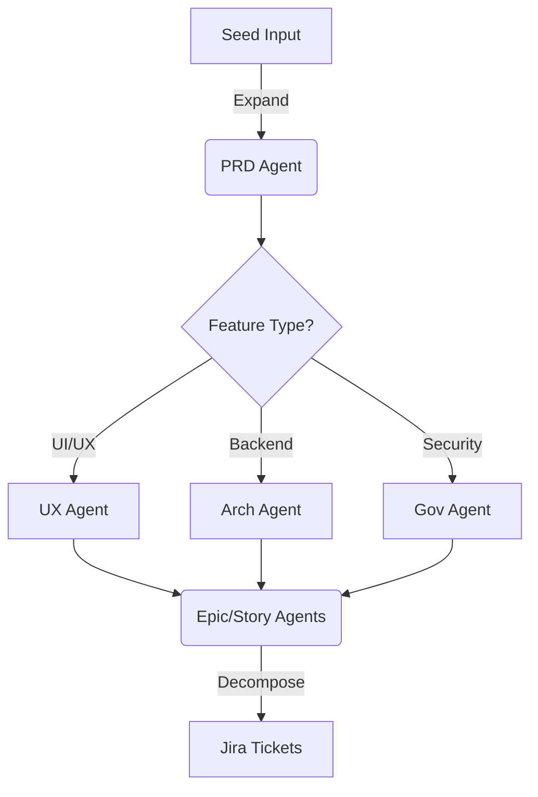

# AI-Augmented Software Development Life Cycle (SDLC)
## A Modern Approach to Building Software with AI Partners

**Version:** 1.0
**Last Updated:** 2025-12-20

---

## Executive Summary

The AI-Augmented SDLC transforms traditional software development by integrating AI agents as collaborative partners at every phase. This approach accelerates delivery, improves quality, and maintains human decision-making authority.

**Key Outcomes:**
- ⏱️ **50% faster** project planning (requirements → architecture → epics)
- 📈 **30% fewer** requirements defects
- 📚 **40% better** documentation quality
- 🎯 **90%+ PRD completeness** (vs. 60-70% without AI)

---

## Traditional SDLC vs. AI-Augmented SDLC

### Traditional SDLC Challenges

**Phase 1: Requirements**
- ❌ PM manually synthesizes 10+ stakeholder interviews
- ❌ Hours spent formatting and structuring PRD
- ❌ Easy to miss requirements hidden in presentations/emails
- ❌ No systematic gap analysis
- ⏱️ **Time:** 2-3 weeks for complex project

**Phase 2: Architecture**
- ❌ Architect reads PRD, extracts requirements manually
- ❌ Creates diagrams one at a time
- ❌ May miss edge cases or dependencies
- ❌ Limited time for exploring alternatives
- ⏱️ **Time:** 1-2 weeks

**Phase 3: Epic Decomposition**
- ❌ Manual decomposition of features into epics
- ❌ Inconsistent epic sizing
- ❌ Dependencies not always clear
- ❌ Story estimation highly variable
- ⏱️ **Time:** 1 week

**Phase 4: Story Writing**
- ❌ Writing 50+ stories manually is tedious
- ❌ Inconsistent acceptance criteria
- ❌ Missing edge cases
- ❌ Incomplete technical details
- ⏱️ **Time:** 1-2 weeks

**Total Planning Time:** 5-8 weeks

### AI-Augmented SDLC Solution

**Phase 1: Requirements & Visualization (with PRD & Vision Agents)**
- ✅ AI ingests presentations, emails, notes (5-10 documents)
- ✅ **Reference-Driven Design:** AI analyzes "example pics" (screenshots, sketches) to generate wireframes
- ✅ AI synthesizes information against PRD template
- ✅ AI identifies gaps and conflicts automatically
- ✅ AI generates structured PRD draft and low-fidelity mockups
- ⏱️ **Time:** 3-5 days (60% faster)

**Phase 1.5: Stakeholder Alignment (The "Pitch")**
- ✅ **Input:** Drafted PRD/Epics
- ✅ **Tool:** Gemini Advanced + Slides API
- ✅ **Action:** AI acts as a "Creative Technologist", transforming raw requirements into visual pitch decks and high-level user flows.
- ✅ **Goal:** Executive Buy-in. Move from "Wireframing" to "Selling" before architecture investment.
- ⏱️ **Time:** 1-2 days

**Phase 2: Architecture (with Architecture Agent)**
- ✅ AI analyzes PRD, extracts requirements
- ✅ AI generates C4 diagrams (Context, Container, Component)
- ✅ AI suggests data models and API contracts
- ✅ Architect reviews, refines, adds expertise
- ✅ AI documents decisions as ADRs
- ⏱️ **Time:** 3-5 days (50% faster)

**Phase 3: Epic Decomposition (with Epic Agent)**
- ✅ AI analyzes PRD + Architecture
- ✅ AI proposes epics with clear boundaries
- ✅ AI estimates complexity and dependencies
- ✅ PM reviews and adjusts
- ⏱️ **Time:** 1-2 days (70% faster)

**Phase 4: Story Writing (with Story Agent)**
- ✅ AI generates stories from epics
- ✅ AI writes acceptance criteria
- ✅ AI includes technical implementation notes
- ✅ Team reviews and refines
- ⏱️ **Time:** 2-3 days (60% faster)

**Total Planning Time:** 2-3 weeks (50% reduction)

---

## The AI-Augmented SDLC Workflow

## The Dynamic Elaboration Workflow ("Holographic Expansion")

This workflow follows a **"Holographic Expansion"** strategy. We start with a small "seed" of user information and then use specialized AI agents to expand it outward into different dimensions—visual, interactive, structural, and tactical.

### 1. The Seed (Input)
Everything starts with what you have. This is usually "messy" human data:
*   **Raw Docs:** Stakeholder emails, PDF business cases, meeting notes.
*   **The "Picture":** A whiteboard sketch or a screenshot of a competitor.
*   **NotebookLM:** If you have 20+ docs, you first use NotebookLM to summarize them into a `summary.md`.

### 2. Holographic Expansion (The PRD Agent)
We don't just "summarize" the seed. We expand it into a 3D view of the product using the **PRD Agent**:
*   **Logic Expansion:** Writes standard functional requirements.
*   **Visual Expansion (Mind Map):** Generates a Mermaid Mind Map (`graph TD`) to visualize the feature tree.
*   **Usage Simulation (Roleplay):** "Hallucinates" a Persona (e.g., "Sarah the Admin") and interviews her to validate requirements.
*   **Value Mapping (KPIs):** Links every feature to a business goal (e.g., "Auto-Save" -> "Reduce Data Loss Complaints by 20%").
*   **Output:** `PRD.md` (Visuals + Interviews + Data).

### 3. The "Conditional" Branch (Micro-Agents)
This is where "depending on the situation" comes into play. You choose the **Micro-Agent** based on the feature type:

| **Situation** | **Tool to Use** | **Diagram Created** |
| :--- | :--- | :--- |
| **Frontend/UI Feature** | `python ux_agent.py --task wireframes` | **Mermaid Sequence / Wireframe** |
| **Backend/Data Feature** | `python architecture_agent.py --task dbml` | **DBML Schema** |
| **API/Integration** | `python architecture_agent.py --task openapi` | **OpenAPI Spec (YAML)** |
| **Compliance/Security** | `python governance_agent.py --task review` | **Audit Report** |

### 4. Tactical Decomposition (Epic & Story Agents)
Once the "Shape" (PRD) and "Structure" (Architecture/UX) are defined, we break it down:

*   **Epic Agent**: Uses **SPIDR** method and runs a **CRUD Matrix** (Create/Read/Update/Delete) to ensure data completeness.
*   **Story Agent**: Writes Gherkin syntax and runs a **Premortem Analysis** ("Edge Case Matrix") to stress-test failure modes.



---

## Key Principles of AI-Augmented SDLC

### 1. Documentation is the Foundation

**Why Documentation Matters:**
- AI agents need structured context to be effective
- Templates ensure consistency
- Clear documentation makes agents predictable
- Documentation serves as single source of truth

**What This Means in Practice:**
- Invest time upfront in creating good templates
- Maintain templates as you learn what works
- Treat documentation as code (version control, reviews)
- Update documentation throughout project lifecycle

**Example:**
```markdown
# Bad: Unstructured notes
"Talked to Sarah about user management. Need login, roles,
permissions. Also discussed dashboard."

# Good: Structured documentation
## User Management Requirements

### User Story
As a system administrator, I need to manage user roles so that
I can control access to features.

### Acceptance Criteria
1. Admin can create user accounts
2. Admin can assign roles (Admin, Manager, User)
3. Each role has predefined permissions
4. Users see only features their role allows

### Technical Constraints
- Must integrate with existing SSO (Okta)
- Role changes take effect immediately
```

The structured version gives AI agents clear context to work with.

### 2. Documentation as Code (The "Solid" State)

**Why Docs Must Be Code:**
- **Version Control:** Specs must evolve with the code in Git.
- **Machine Readability:** Use Markdown (.md) and Mermaid.js so agents can parse and generate them.
- **Living Diagrams:** Architecture diagrams are generated from code (Python Diagrams/C4), preventing "diagram rot."
- **Standardization:** Use a `.gemini/` folder for style guides that instruct agents on your specific documentation standards.

### 2. The 3 States of Requirements (from User Vision)
We recognize that requirements exist in three states, and standard docs only catch the solids.

*   **SOLID (Documentation):** Legacy code, regulations, existing PDFs.
*   **LIQUID (Conversation):** What is said in meetings, emails, and Slack.
*   **GAS (Unspoken Ideas):** Latent edge cases, "what ifs", and unspoken assumptions.

**Our Agents are designed specifically to mine the "Gas":**
*   **Brainstorming:** AI does edge case stress-testing (Premortems).
*   **Persona Simulation:** AI plays a persona (e.g. "Customer") to validate flows.
*   **Mind Maps:** Real-time branching of thought (e.g. "Payment" -> "Refunds/Tax").
*   **Traceability:** AI automates the laborious linking of every requirement.

**The "3 Layers" of Requirements:**
1.  **Vision (Layer 1):** Strategic outcomes in the Pitch Deck.
2.  **Logic (Layer 2):** Functional flows in Epics/Wireframes.
3.  **Foundation (Layer 3):** Technical constraints in the Architecture Hub.

### 3. The 3 Planes of Development Model
To avoid confusion about where "Wireframes" fit, we define 3 distinct planes:

1.  **The Problem Plane (Requirements):** Static business rules ("Must process payments").
    *   *AI Role:* The Analyst (PRD Agent).
2.  **The Solution Plane (The Interaction Layer):** The contract of *Time & Behavior*.
    *   *Definition:* How a human moves through the system over time.
    *   *Artifacts:* Screen Flows, Wireframes, User Journeys.
    *   *AI Role:* The UX Architect (Technique D).
3.  **The Construction Plane (Architecture):** The system implementation.
    *   *Definition:* How the system supports the behavior.
    *   *SI Role:* The Systems Architect (Architecture Agent).

### 4. Agents are Specialists, Not Generalists

**Why Specialization Works:**
- Each SDLC phase has unique needs
- Specialized prompts produce better results
- Clear boundaries prevent scope creep
- Easier to measure agent effectiveness

**Agent Specialization Model:**

```
PRD Agent (Requirements Specialist)
  ├─ Multi-document synthesis
  ├─ Gap analysis
  ├─ Conflict detection
  └─ Structured PRD generation

Architecture Agent (Design Specialist)
  ├─ Requirements extraction
  ├─ Diagram generation (C4)
  ├─ Data model design
  └─ ADR documentation

Epic Agent (Decomposition Specialist)
  ├─ Feature boundary identification
  ├─ Dependency mapping
  ├─ Complexity estimation
  └─ Implementation sequencing

Story Agent (Detail Specialist)
  ├─ Story generation from epics
  ├─ Acceptance criteria writing
  ├─ Technical detail elaboration
  └─ Story point estimation
```

**Anti-Pattern: Single "Do Everything" Agent**
- ❌ One agent for PRD + Architecture + Stories
- ❌ Prompts become too complex
- ❌ Quality suffers across all areas
- ❌ Difficult to improve specific areas

### 3. Human Expertise is Amplified, Not Replaced

**AI Agent Role:** Draft, Synthesize, Identify Gaps
**Human Role:** Decide, Refine, Add Domain Expertise

**Example: PRD Writing**

```
AI Agent Contributions (80% of content):
✓ Extract 23 features from 5 documents
✓ Identify 3 user personas from interview notes
✓ Generate executive summary from business case
✓ Structure content according to template
✓ Flag 5 missing requirements
✓ Identify 2 conflicts between documents

Human Contributions (Critical 20%):
✓ Resolve conflict: "Mobile-first" vs "Web-only v1" → Decision: Web v1, mobile v2
✓ Define success metrics (AI suggested, human quantified)
✓ Add market context and competitive analysis
✓ Prioritize features (high/medium/low)
✓ Make strategic trade-offs
✓ Approve final PRD for stakeholders
```

**Result:** PM focuses on strategic decisions, AI handles synthesis and structure.

### 4. Iterative Refinement Over Perfect First Draft

**Traditional Approach:**
- Spend weeks crafting perfect PRD manually
- One big review at the end
- Costly to make changes

**AI-Augmented Approach:**
- AI generates 80% draft in hours
- Multiple rounds of refinement
- Rapid iteration based on feedback
- Lower cost of change

**Iteration Pattern:**

```
Round 1: AI generates initial draft from documents
  ↓
Human review: "Missing success metrics, unclear scope boundaries"
  ↓
Round 2: AI adds metrics section, clarifies scope
  ↓
Human review: "Metrics need quantification, add timeline"
  ↓
Round 3: AI adds specific targets and timeline
  ↓
Human review: "Looks good, minor edits"
  ↓
Final: Human makes final refinements, approves
```

**Each round takes 10-30 minutes, not hours.**

### 5. Measure and Improve Continuously

**What to Measure:**

**Agent Quality Metrics:**
- PRD completeness score (% of template filled)
- Requirements clarity (peer review rating)
- Gap identification rate (% of real gaps caught)
- User satisfaction (agent helpfulness rating)

**Business Impact Metrics:**
- Time to PRD (days from kickoff to approved PRD)
- Time to architecture (days from PRD to approved architecture)
- Requirements defects (# found in dev/QA)
- Documentation quality (team survey)

**Cost Metrics:**
- AI API costs per project
- Time saved per project (hours)
- Cost per hour saved
- ROI (savings / investment)

**Example Dashboard:**
```
Project: Customer Portal Redesign

Agent Performance:
├─ PRD Completeness: 92% ✅ (target: 90%)
├─ Time to PRD: 4 days ✅ (target: 5 days)
├─ Gap Identification: 87% ✅ (7/8 gaps caught)
└─ User Satisfaction: 4.5/5.0 ✅

Cost Analysis:
├─ AI API costs: $45
├─ Time saved: 35 hours
├─ Cost per hour: $1.29
└─ ROI: 3,483% (35hrs × $200/hr saved vs $45 cost)
```

---

## Agent Handoff Pattern

One of the most powerful aspects of AI-Augmented SDLC is how agents pass context to each other:

```
┌──────────────────┐
│   PRD Agent      │
│  (Phase 1)       │
│                  │
│  OUTPUT:         │
│  • PRD.md        │
│  • Requirements  │
│  • Constraints   │
└────────┬─────────┘
         │
         ├─────────────────────────────────────┐
         │                                     │
         ↓                                     ↓
┌──────────────────┐                 ┌──────────────────┐
│ Architecture     │                 │  Epic Agent      │
│ Agent            │                 │  (Phase 3)       │
│ (Phase 2)        │                 │                  │
│                  │                 │  Can also read:  │
│  INPUT:          │                 │  • PRD.md        │
│  • PRD.md        │                 │  • Architecture  │
│                  │                 │                  │
│  OUTPUT:         │────────────────>│  OUTPUT:         │
│  • C4 Diagrams   │                 │  • Epics         │
│  • Data Models   │                 │  • Dependencies  │
│  • ADRs          │                 └────────┬─────────┘
└──────────────────┘                          │
                                              ↓
                                     ┌──────────────────┐
                                     │  Story Agent     │
                                     │  (Phase 4)       │
                                     │                  │
                                     │  INPUT:          │
                                     │  • Epics         │
                                     │  • Architecture  │
                                     │                  │
                                     │  OUTPUT:         │
                                     │  • User Stories  │
                                     │  • Acceptance    │
                                     │    Criteria      │
                                     └──────────────────┘
```

**Key Benefits:**
1. **Consistency:** Each agent builds on previous work
2. **Context Preservation:** No information lost between phases
3. **Traceability:** Clear lineage from requirement → epic → story → code
4. **Efficiency:** No re-extracting information

**Implementation:**
- All artifacts stored in Git (single source of truth)
- Each agent reads relevant files from repository
- Agents reference documents explicitly in their outputs
- Humans review and approve before handoff to next phase

---

## Success Factors

### ✅ Critical Success Factors

**1. Executive Sponsorship**
- Leadership commits to documentation-driven development
- Budget allocated for AI infrastructure
- Success metrics defined and tracked

**2. Template Investment**
- High-quality templates for each document type
- Templates refined based on agent feedback
- Examples provided for each template

**3. Team Training**
- 2-hour workshop on AI-augmented SDLC concepts
- Hands-on practice with one agent
- Clear guidelines on when to use agents vs. manual work

**4. Iterative Rollout**
- Start with one agent (PRD Agent recommended)
- Pilot on small project
- Gather feedback and improve
- Expand to more agents gradually

**5. Feedback Loops**
- Regular retrospectives on agent usage
- Metrics tracked and reviewed monthly
- Continuous improvement of prompts and processes

### ⚠️ Common Pitfalls

**1. Expecting AI to Replace Humans**
- ❌ "AI will write all our PRDs, we don't need PMs"
- ✅ "AI will help PMs write better PRDs faster"

**2. Poor Documentation Templates**
- ❌ Vague templates with minimal structure
- ✅ Detailed templates with examples and clear sections

**3. No Human Review**
- ❌ Blindly accepting AI-generated content
- ✅ Review, refine, and approve all AI outputs

**4. Trying to Boil the Ocean**
- ❌ Deploy all 7 agents at once
- ✅ Start with 1-2 agents, expand gradually

**5. Not Measuring Impact**
- ❌ "It feels faster"
- ✅ Track time, quality, and cost metrics

---

## Real-World Example: Gemini Personal Stylist (Deep Dive)

The Gemini Personal Stylist project demonstrates this methodology in action. Here is the *exact* workflow we used:

### Phase 1: Requirements (NotebookLM & Vision)
**Goal:** Define the product and its look.

**Step A: Analysis**
*   **Input**: Uploaded 5 PDF market reports and a photo of a whiteboard sketch.
*   **Prompt (NotebookLM)**: "Based on these reports, what are the top 3 user pain points? Also, analyze the whiteboard photo and describe the intended UI layout."
*   **Output**: "Pain points: Decision fatigue, sizing uncertainty, return hassle. The sketch shows a Tinder-style swipe interface for outfits."

**Step B: Visual Spec (Reference-Driven Design)**
*   **Input**: A screenshot of a competitor's app (referencing the 'clean aesthetic').
*   **Prompt (Antigravity)**: "Generate a low-fidelity wireframe for the 'Daily Pick' screen. Use this screenshot as a style reference for the spacing and typography, but implement the swipe-card layout from the whiteboard sketch."
*   **Result**: AI generates a wireframe image and a Tailwind CSS snippet for the layout.

### Phase 2: Architecture (Gemini Advanced)
**Goal:** Turn the PRD into a system spec.

*   **Input**: `PRD.md` path.
*   **Prompt**: "Create a C4 Container diagram for the system. It must use Cloud Run services. Output as Mermaid code."
*   **Output**: 
    ```mermaid
    C4Container
    Container(api, "API Gateway", "FastAPI", "Handles client requests")
    Container(stylist, "Stylist Agent", "Python/LangChain", "Generates outfits")
    Container(db, "Wardrobe DB", "Firestore", "Stores user clothes")
    Rel(api, stylist, "Uses", "HTTPS")
    Rel(stylist, db, "Reads", "gRPC")
    ```
*   **Impact**: This Mermaid code became the `System_Architecture.md` file, serving as the blueprint for the next phase.

### Phase 3: Build (Antigravity)
**Goal:** Implement the 'Stylist Agent' container.

*   **Input**: `System_Architecture.md` and `PRD.md`.
*   **Step**: The developer opens the terminal in the IDE.
*   **Command**:
    ```bash
    @antigravity "Scaffold the 'stylist' microservice based on the Architecture doc.
    It needs a standard Flask structure.
    Create a 'recommend_outfit' function that accepts a UserID."
    ```
*   **Agent Action**: 
    1. Executed `mkdir microservices/stylist`
    2. Created `app.py`, `requirements.txt`, `Dockerfile`
    3. Wrote the boilerplate Flask code and the empty `recommend_outfit` function.
    
**Result**: A deployable "Hello World" service in < 60 seconds, perfectly aligned with the architecture specs.

---

## The Extended Agent Ecosystem (Future Vision)

We are actively building the next generation of agents to further reduce the "Coordination Tax":

1.  **`Jira_Agent`**: Watches the `docs/` folder. When `PRD.md` is approved/merged, it automatically creates the corresponding Epics and Stories in Jira, linking them back to the source text.
2.  **`Review_Agent`**: A "Security Champion" bot. It reviews every Pull Request specifically for OWASP Top 10 vulnerabilities and PII leaks before a human reviewer even sees it.
3.  **`Analytics_Agent`**: Tracks the workflow velocity. It measures the time difference between a requirement being written and the code being deployed, identifying bottlenecks.

---

## Comparison to Other Approaches

### vs. Traditional Waterfall
- **Waterfall:** Linear, document-heavy, slow feedback
- **AI-Augmented:** Iterative, AI-assisted docs, rapid feedback
- **Advantage:** 50% faster, same or better documentation quality

### vs. Pure Agile (Minimal Docs)
- **Pure Agile:** Light on documentation, fast iteration
- **AI-Augmented:** Comprehensive docs generated quickly, fast iteration
- **Advantage:** Best of both - speed + documentation

### vs. Manual Documentation-Driven
- **Manual:** Thorough documentation, but very slow
- **AI-Augmented:** Thorough documentation, AI accelerates writing
- **Advantage:** Same thoroughness, 50% less time

---

## Next Steps

Now that you understand the AI-Augmented SDLC at a high level:

1. **Read:** [`documentation-driven-development.md`](documentation-driven-development.md) - Understand the foundation
2. **Read:** [`agent-design-principles.md`](agent-design-principles.md) - Learn how agents are designed
3. **Explore:** [`../process/`](../process/) - See detailed workflows for each phase
4. **Review:** [`../agents/agent-selection-framework.md`](../agents/agent-selection-framework.md) - Decide which agents to build first

---

## Summary

The AI-Augmented SDLC is not about replacing humans with AI. It's about:

✅ **Amplifying human expertise** with AI assistance
✅ **Accelerating routine tasks** (synthesis, formatting, generation)
✅ **Improving consistency** through templates and standardization
✅ **Maintaining quality** through human review and refinement
✅ **Enabling better decisions** by freeing humans from tedious work

**The result:** Faster delivery, better documentation, happier teams, and higher quality software.

---

**Ready to dive deeper?** Continue with [Documentation-Driven Development](documentation-driven-development.md).
