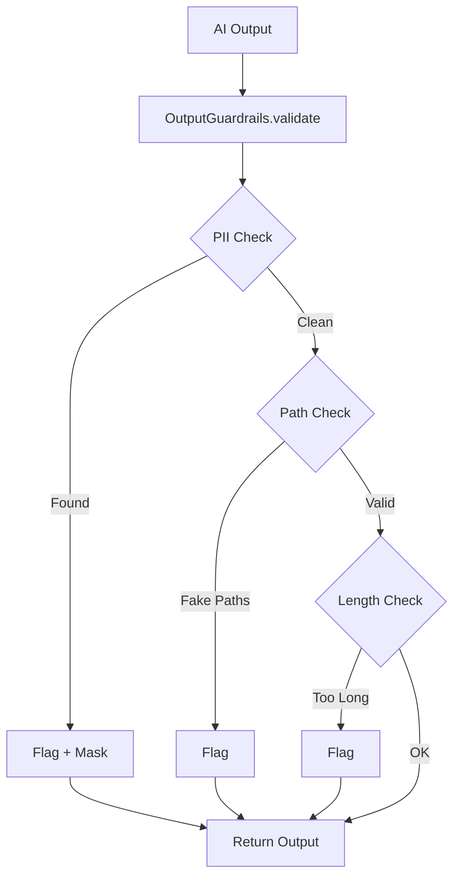

# AI Safety & Guardrails

> **"Trust, but verify."**

---

## Why Guardrails?

AI models can:
- **Hallucinate** file paths, APIs, or entities that don't exist
- **Leak PII** if training data contained sensitive information
- **Generate excessive output** that overwhelms systems
- **Produce invalid structured data** (broken JSON, YAML)

---

## Automated Enforcement

The `OutputGuardrails` class validates all AI output:

```python
from guardrails import OutputGuardrails

guardrails = OutputGuardrails()
is_valid, issues = guardrails.validate(ai_output, context={
    "known_paths": ["/path/to/real/file.py"]
})

if not is_valid:
    print(f"Issues found: {issues}")
    sanitized = guardrails.sanitize(ai_output)
```

---

## Built-in Checks

| Check | What It Detects | Action |
|:------|:----------------|:-------|
| **PII Detection** | Emails, SSNs, phone numbers, credit cards | Warn + Sanitize |
| **Path Validation** | File paths that don't exist | Warn |
| **Length Limits** | Output > 50,000 chars | Warn |
| **JSON Validation** | Invalid JSON when JSON expected | Error |

---

## How It Works



---

## Integration with Base Agent

Guardrails are enabled by default in `GenAIBaseAgent`:

```python
class MyAgent(GenAIBaseAgent):
    def __init__(self):
        super().__init__(
            enable_guardrails=True  # Default
        )
```

Every call to `self.generate()` automatically validates output.

---

## Sanitization

When PII is detected, it's automatically masked:

```
Before: Contact john.doe@example.com or call 555-123-4567
After:  Contact [EMAIL REDACTED] or call [PHONE REDACTED]
```

---

## Custom Configuration

```python
from guardrails import OutputGuardrails

guardrails = OutputGuardrails(config={
    "max_output_length": 100000,  # Increase limit
    "check_pii": True,
    "check_paths": False,  # Disable path checking
    "check_json": True
})
```

---

## Related

- [Human-in-the-Loop](human-in-the-loop.md)
- [Guardrails Implementation](../standards/guardrails.py)
