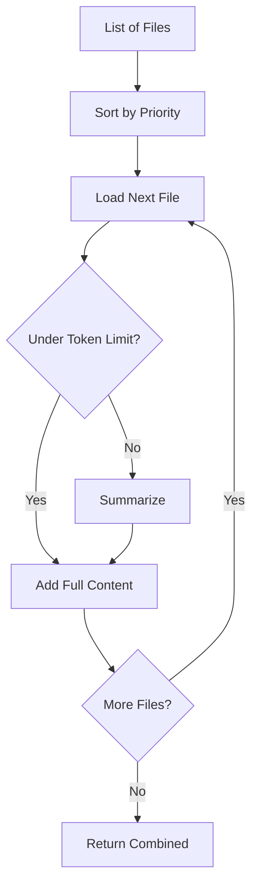

# Context Window Management

> **"Feed AI the right context, not all the context."**

---

## The Problem

LLMs have context windows (e.g., 128K tokens for Gemini 1.5 Pro). Loading too much:
- **Wastes tokens** (costs money)
- **Dilutes relevance** (important info gets lost)
- **Hits limits** (errors when exceeded)

---

## The Solution: Smart Context Loading

The `ContextManager` handles large documents intelligently:

```python
from context_manager import ContextManager

ctx = ContextManager(max_tokens=100000)

# Load documents with smart handling
documents = ctx.load_documents([
    "docs/PRD.md",
    "docs/API.yaml",
    "src/main.py"
], prioritize=["requirements", "API"])
```

---

## Features

| Feature | What It Does |
|:--------|:-------------|
| **Smart Truncation** | Cuts at logical boundaries (lines, functions) |
| **Prioritization** | Loads relevant files first |
| **Token Counting** | Tracks usage, warns at limits |
| **Summarization** | Auto-summarizes oversized files |
| **Chunking** | Splits by function/class/section |

---

## How It Works



---

## Token Budget

Track token usage across a session:

```python
from context_manager import TokenBudget

budget = TokenBudget(budget=500000)

budget.spend(1000, "input prompt")
budget.spend(500, "output")

print(budget.remaining())  # 498500
print(budget.report())     # "Token Budget: 1,500 / 500,000 (0.3% used)"
```

---

## Chunking by Structure

Split files by logical units:

```python
chunks = ctx.chunk_by_structure(code, file_type="python")
# Returns: [{name: "MyClass", content: "...", tokens: 500}, ...]

# Select relevant chunks
relevant = ctx.get_relevant_chunks(chunks, query="user authentication")
```

---

## Integration with Base Agent

Built into `GenAIBaseAgent`:

```python
class MyAgent(GenAIBaseAgent):
    def analyze(self, file_paths):
        # Uses context manager automatically
        context = self.load_context(
            paths=file_paths,
            prioritize=["requirements", "spec"]
        )
        return self.generate(f"Analyze:\n{context}")
```

---

## Strategies for Large Codebases

| Strategy | When to Use |
|:---------|:------------|
| **Prioritize** | Load most relevant files first |
| **Summarize** | Get overview before details |
| **Chunk** | Focus on specific functions/classes |
| **Iterative** | Load, analyze, load more based on findings |

---

## Best Practices

1. **Always prioritize** — Order files by relevance to the task
2. **Use chunking for code** — Functions are better units than whole files
3. **Track budget** — Log token usage to optimize costs
4. **Summarize first** — Get overview before deep dives

---

## Related

- [Context Manager Implementation](../standards/context_manager.py)
- [Token Budget Tracking](../standards/context_manager.py)
