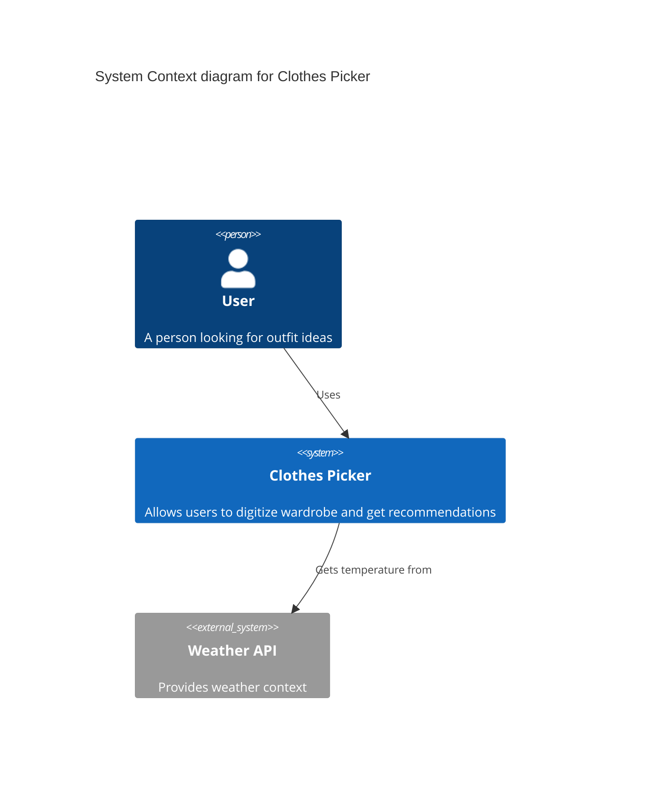
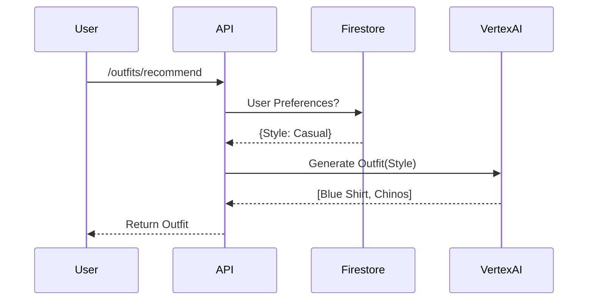

# Diagrams as Code Guide

**Version:** 1.0
**Last Updated:** January 2026

---

## 1. Philosophy: Why "Diagrams as Code"?

Traditional architecture diagrams (Visio, Lucidchart, slides) suffer from "implementation drift": the moment they are drawn, they begin to diverge from the actual code. They are "dead" artifacts.

**Diagrams as Code** treats diagrams as living software artifacts:
1.  **Version Controlled:** Changes are tracked in Git.
2.  **Reviewable:** Diffs are visible in Pull Requests (e.g., changing a connection line is a text change).
3.  **Automated:** Generated as part of the CI/CD pipeline.
4.  **Consistent:** Uses standard icons and layouts automatically.

## 2. The Toolset

We use a specific tool for each layer of abstraction:

| Diagram Layer | Tool | File Extension | Why? |
| :--- | :--- | :--- | :--- |
| **C4 Context & Container** | **Mermaid.js** | `.mmd` | Native GitHub support, simple syntax for high-level flows. |
| **Cloud Infrastructure** | **Python Diagrams** | `.py` | Powerful for drawing concrete GCP/AWS resources and relationships. |
| **Database Schema** | **DBML** | `.dbml` | Database-agnostic, readable, and visually renderable. |
| **API Workflows** | **Mermaid Sequence** | `.mmd` | Excellent for showing request/response flows between services. |

---

## 3. Python Diagrams (Infrastructure & Application Architecture)

We use the [Diagrams](https://diagrams.mingrammer.com/) Python library to systematically draw our cloud infrastructure.

### Location
Source files live in: `doc_info/architecture-hub/diagrams/src/`

### How to Edit
1.  Open `doc_info/architecture-hub/diagrams/src/generate_architecture.py`.
2.  Edit the Python code to add nodes or edges.
3.  Run the script to regenerate the PNG.

### Example Code
```python
from diagrams import Diagram, Cluster
from diagrams.gcp.compute import Run
from diagrams.gcp.database import Firestore
from diagrams.onprem.client import Mobile

with Diagram("Clothes Picker Architecture", show=False):
    client = Mobile("Flutter App")
    
    with Cluster("Backend"):
        api = Run("API Service")
        db = Firestore("Application Data")
        
    client >> api >> db
```

### Installation
```bash
brew install graphviz
pip install diagrams
```

---

## 4. Mermaid.js (Logical & Sequence Diagrams)

Mermaid is built into GitHub and our documentation tools. Use it for C4 diagrams and Sequence diagrams.

### Location
`doc_info/architecture-hub/diagrams/*.mmd` or embedded directly in Markdown files.

### C4 Container Example


### Sequence Diagram Example


---

## 5. DBML (Data Modeling)

DBML (Database Markup Language) is used to define our database schemas. It looks like SQL but is designed for design.

### Location
`doc_info/architecture-hub/data-models/*.dbml`

### Workflow
1.  Edit the `.dbml` file.
2.  Use a VS Code extension (like "vscode-dbml") to preview the Entity-Relationship Diagram (ERD).
3.  (Optional) Use a parser to convert DBML to SQL for migration scripts.

### Example
```dbml
Table users {
  id integer [primary key]
  username varchar
  created_at timestamp
}

Table outfits {
  id integer [primary key]
  user_id integer
}

Ref: outfits.user_id > users.id
```

---

## 6. Best Practices

-   **Do not manually commit generated images** (unless necessary for READMEs). Ideally, generate them in CI.
-   **Keep diagrams high-level.** Don't model every single class or function.
-   **Link to code.** Comments in the diagram source code should point to the actual implementation files.
-   **Review changes.** When altering architecture, the PR must include changes to these diagram modifications.
