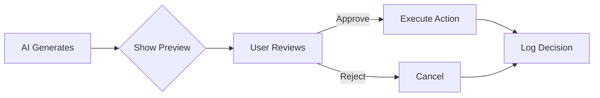

# Human-in-the-Loop (HITL) Patterns

> **"AI generates, humans approve."**

---

## Why HITL?

AI-generated content should be reviewed before:
- Saving to permanent storage
- Creating external resources (Jira tickets, PRs)
- Making API calls with side effects
- Modifying production configurations

---

## Automated Enforcement

The `ApprovalGate` class is built into `GenAIBaseAgent`:

```python
# In your agent
output = self.generate_with_approval(
    prompt="Generate the PRD...",
    action_description="Save PRD to outputs/"
)
# Agent pauses, shows preview, waits for y/n
```

---

## Approval Flow



---

## Configuration

```python
class MyAgent(GenAIBaseAgent):
    def __init__(self):
        super().__init__(
            require_approval=True  # All actions need approval
        )
```

Or disable globally:
```python
super().__init__(require_approval=False)  # Auto-approve (dev mode)
```

---

## Audit Trail

All approval decisions are logged:

```python
audit = agent.get_approval_audit()
# [{"timestamp": "...", "action": "Save PRD", "decision": "approved"}]
```

---

## When to Require Approval

| Action | Require Approval? |
|:-------|:------------------|
| Generate text for display | ❌ No |
| Save to file | ✅ Yes |
| Create Jira ticket | ✅ Yes |
| Send email/notification | ✅ Yes |
| Run discovery tool | ❌ No |
| Modify production config | ✅ Absolutely |

---

## Related

- [AI Guardrails](ai-safety-guardrails.md)
- [Output Validation](../standards/guardrails.py)
