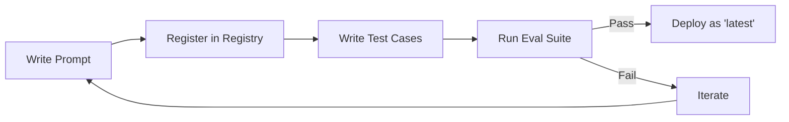

# Prompt Operations (Prompt-Ops)

> **"Treat prompts like code: version, test, evaluate."**

---

## Why Prompt-Ops?

Prompts are the new code. They should have:
- **Versioning** — Track changes over time
- **Testing** — Verify they produce expected outputs
- **Evaluation** — Measure quality metrics
- **Registry** — Central catalog of all prompts

---

## The Prompt Registry

All prompts are registered in `prompts/registry.json`:

```json
{
  "prompts": {
    "PRD_GEN": {
      "latest": "v2",
      "versions": {
        "v1": {"path": "prompts/PRD_GEN-v1.md"},
        "v2": {"path": "prompts/PRD_GEN-v2.md"}
      },
      "test_cases": "prompts/tests/prd_gen_tests.json"
    }
  }
}
```

---

## Using the Registry

```python
from prompt_registry import PromptRegistry

registry = PromptRegistry()

# Get latest version
prompt = registry.get_prompt("PRD_GEN")

# Get specific version
prompt_v1 = registry.get_prompt("PRD_GEN", version="v1")

# List all prompts
all_prompts = registry.list_prompts()
```

---

## Testing Prompts

```python
from prompt_registry import PromptEvaluator, create_test_case

evaluator = PromptEvaluator(generator_fn=agent.generate)

test_cases = [
    create_test_case(
        name="Should include user stories",
        expected_contains=["User Story", "As a"],
        expected_not_contains=["TODO", "placeholder"]
    ),
    create_test_case(
        name="Should be under 5000 chars",
        max_length=5000
    )
]

results = evaluator.run_test_suite(prompt, test_cases)
print(f"Passed: {results['passed']}/{results['total']}")
```

---

## A/B Comparison

Compare two prompt versions:

```python
comparison = evaluator.compare_prompts(
    prompt_a=registry.get_prompt("PRD_GEN", "v1"),
    prompt_b=registry.get_prompt("PRD_GEN", "v2"),
    test_cases=test_cases
)
print(f"Winner: {comparison['winner']}")
```

---

## Prompt Lifecycle



---

## CI Integration

Add to your CI pipeline:

```yaml
- name: Test Prompts
  run: python -m pytest tests/test_prompts.py
```

---

## Best Practices

1. **Never edit prompts in place** — Create a new version
2. **Always test before promoting** — Run test suite before setting as "latest"
3. **Document changes** — Add notes in registry for each version
4. **Measure metrics** — Track success rate, output quality over time

---

## Related

- [Prompt Registry Implementation](../standards/prompt_registry.py)
- [Prompt Templates](../../prompts/)
