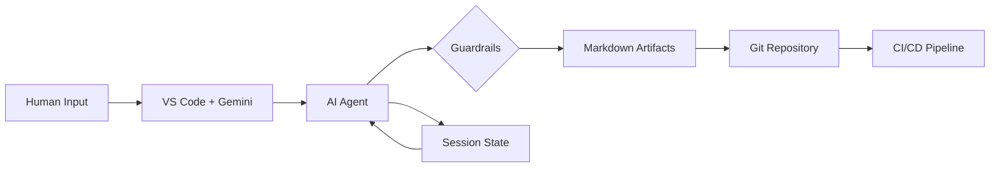

# User Slide Content V2 (Framework-Consistent Edition)

## Slide 1: THE NINE PILLARS OF AI-AUGMENTED SDLC

### Pillar 1: VS Code as Home Base
**One environment for everything:**
*   **Gemini Code Assist** – AI pair programmer in the editor
*   **Slash Commands** – `/prd-discover`, `/epic-split`, `/arch-design`
*   **Integrated Terminal** – Gemini CLI - Run agents directly
*   **Git Integration** – Commit, push, PR without leaving the IDE
*   **Jira Integration** – Sync without leaving the IDE


### Pillar 2: Documentation as Code
Everything that describes the system lives **in Git, as text**:
*   **`.md` files** – Markdown for all documentation (PRD, Epics, Stories, ADRs)
*   **Version Controlled** – Changes tracked, reviewable in PRs, rollback possible
*   **`.gemini/STYLEGUIDE.md`** – Teaches AI assistants about project conventions

### Pillar 3: Diagrams as Code
Visuals are **generated from text**, not drawn manually:
| Domain | Tool | Output |
|:-------|:-----|:-------|
| **UX** | Mermaid | User Journeys, State Diagrams, Flowcharts |
| **Architecture** | Mermaid (C4), Python Diagrams | System Structure, Infrastructure |
| **Data** | DBML | Entity-Relationship Diagrams |
| **APIs** | OpenAPI | Swagger UI, Client SDKs |

### Pillar 4: Agent-Generated Artifacts
Outputs are **created by AI Agents**, not written from scratch:

| Phase | Agent | Slash Command | Output |
|:------|:------|:--------------|:-------|
| **Requirements** | PRD Agent | `/prd-discover` | PRD from stakeholder input |
| **Elaboration** | Epic Decomposition | `/epic-split` | Epics using SPIDR |
| **Elaboration** | Epic Elaboration | `/epic-elaborate` | CRUD, State, Edge cases |
| **Elaboration** | Story Agent | `/story-gen` | Jira-ready User Stories |
| **UX Design** | UX Agent | `/ux-personas` | Personas, Wireframes |
| **Interfaces** | Interface Agent | `/interface-discover` | Context diagram, Interface catalog |
| **Interfaces** | Interface Agent | `/interface-spec` | Detailed interface specs |
| **Architecture** | Architecture Agent | `/arch-design` | C4, DBML, OpenAPI |
| **Implementation** | Code Governance | `/code-review` | Static analysis + AI review |
| **Testing** | Test Plan Agent | `/test-plan` | Test plans, unit/E2E stubs |
| **Testing** | Simulation Agent | `/simulate-persona` | Persona edge cases |
| **Testing** | Resilience Agent | `/load-test`, `/chaos-test` | Load scripts, chaos scenarios |
| **Testing** | Interface Agent | `/interface-test` | Contract tests from specs |
| **Integration** | Integration Agent | `/ci-check` | Release readiness check |
| **Planning** | AI Planning Agent | `/dep-discover` | Dependency map, health report |
| **Planning** | Change Mgmt Agent | `/impact-assess` | Impact assessment report |

**Session State:** Agents persist context across sessions (`open_questions.md`, `session_log.md`, `entities.md`).

### Pillar 5: Git Version Control
**Git is the single source of truth:**
*   **All artifacts in one repo** – Docs, diagrams, code, and tests together
*   **Pull Request workflow** – Every change is reviewed (by humans AND AI)
*   **Full history** – Roll back any document to any point in time

### Pillar 6: AI Governance
**Built-in safeguards — no guidelines to memorize:**

| Capability | Type | What It Does |
|:-----------|:-----|:-------------|
| **Guardrails** | Automatic | PII detection, hallucination prevention, output limits |
| **Human-in-the-Loop** | Always | **VS Code**: Accept/Reject diffs before file changes apply. **Agents**: Preview before saves. |
| **Prompt-Ops** | Automatic | Versioned prompts, testing, A/B comparison |

### Pillar 7: Context Management
**Optimize AI effectiveness with strategic context:**

| Strategy | What It Does |
|:---------|:-------------|
| **Pre-Processing** | NotebookLM summarizes bulk docs before development |
| **Hierarchical Chunking** | Index → Summary → Detail for large documents |
| **Context Drawer** | Explicitly include/exclude files for AI (Code Assist) |
| **Session State** | `session_log.md`, `entities.md` persist across sessions |
| **Caching** | Reuse common context (STYLEGUIDE, glossary) |

### Pillar 8: AI Planning Intelligence
**Continuous AI monitoring of Jira backlog:**

| Capability | What It Does |
|:-----------|:-------------|
| **Watches** | Monitors Jira as items are created/edited |
| **Discovers** | Infers dependencies from story content |
| **Suggests** | Proposes missing links for human approval |
| **Sequences** | Recommends optimal build order |
| **Alerts** | Notifies when dependency health changes (🔴/🟡/🟢) |
| **Predicts** | Forecasts blockers 1-2 sprints ahead |

**Key Insight:** This is Jira-centric — planning happens in Jira, not VS Code.

### Pillar 9: Planning & Change Management
**What-If Impact Assessment before any change:**

| Change Type | AI Assesses Impact On |
|:------------|:---------------------|
| **Add** | PRD, Epics, Stories, Architecture, Timeline |
| **Modify** | Which artifacts need updates? How much rework? |
| **Remove** | What becomes orphaned? What's affected downstream? |

**Key Insight:** Assessment only — AI shows blast radius, humans decide.




## Slide 2: JIRA INTEGRATION (Required API Calls)

**Bi-directional sync between Markdown artifacts and Jira tickets:**

| Operation | Jira API Call | When Used |
|:----------|:--------------|:----------|
| **Create Epic** | `POST /rest/api/3/issue` (type: Epic) | After Epic decomposition |
| **Create Story** | `POST /rest/api/3/issue` (type: Story) | After story generation |
| **Link to Parent** | `POST /rest/api/3/issueLink` | Link Story → Epic → PRD |
| **Update Status** | `PUT /rest/api/3/issue/{id}/transitions` | On status change |
| **Add Attachment** | `POST /rest/api/3/issue/{id}/attachments` | Attach Gherkin, diagrams |
| **Sync Description** | `PUT /rest/api/3/issue/{id}` | Update from markdown |
| **Read Issue** | `GET /rest/api/3/issue/{id}` | Sync back to local |
| **Search Issues** | `GET /rest/api/3/search` (JQL) | Find related items |

**Traceability Links:**
- PRD Section → Epic (via `issueLink` type: "relates to")
- Epic → Stories (via `issueLink` type: "parent of")
- Story → Test Cases (via custom link type)

**Existing Tools Used:**
- VS Code: Atlassian for VS Code extension
- CLI: `jira-cli` or custom Python wrapper
- CI: GitHub Actions with Jira Issue to Markdown Action


## Slide 3: REQUIREMENTS (The 3-Layer Framework)

### 1. The Framework
Requirements are organized into 3 interlocking layers:
*   **Layer 1: Strategic Vision** - Outcomes not features
*   **Layer 2: Logic & Design** - Functional flows, user experience
*   **Layer 3: Technical Foundation** - Non-functional requirements, data integrity

### 2. The Outputs
| Layer | Artifact Type | Format |
| :--- | :--- | :--- |
| **Layer 1** | Program Requirements Document (PRD) | Markdown |
| **Layer 2** | Epic Definitions & User Stories | Markdown + Gherkin |
| **Layer 2** | Wireframes | PNG/Excalidraw |
| **Layer 3** | Architecture Constraints | ADRs, Diagrams |

### 3. The AI Workflow
**Inputs:** Stakeholder docs, Meeting transcripts, Brainstorming sessions  
**AI Actions:** NotebookLM synthesizes → AI extracts epics → AI generates Gherkin → AI creates wireframes  
**Outputs:** Structured PRD, Epic docs with acceptance criteria, UX flows

## Slide 4: REQUIREMENTS (The States of Information)
**How AI processes information in 3 states:**

*   **(Solid) Documentation – NotebookLM:**
    *   Summarizes existing docs, finds conflicts, extracts topics
    *   Includes regulatory docs, SOPs, legacy code summaries, database schemas
*   **(Liquid) Conversation – AI Transcription:**
    *   Meeting transcripts captured by AI
    *   AI synthesis of stakeholder discussions (from transcripts)
*   **(Gas) Unspoken Ideas – AI Brainstorming:**
    *   Edge case stress-testing, persona simulation
    *   Mind mapping, form-filling, BDD/Gherkin translation
    *   Requirements traceability automation

## Slide 5: EPIC DECOMPOSITION (Vertical Value Streams)

### 1. The Framework: Vertical Slicing + SPIDR
**Two types of epics:**
*   **Business Epics:** User-facing capability that delivers end-to-end value (from PRD functional requirements)
*   **Enabler Epics:** Infrastructure or services needed to support business epics (from Architecture Hub)

**Vertical Slicing Rule:**
*   Every epic cuts through all layers: **UI → API → Database**
*   **Why for AI:** Provides complete context for code generation (user click → data persistence)

**SPIDR Splitting Patterns:**
| Pattern | When to Use | Example |
|:--------|:------------|:--------|
| **Spike** | Unknowns need research first | "Evaluate payment gateways" |
| **Path** | Happy path vs. error handling | "Submit claim" vs. "Handle rejection" |
| **Interface** | Different platforms/complexities | "Mobile checkout" vs. "Web checkout" |
| **Data** | Different data sources/types | "Import CSV" vs. "API sync" |
| **Rules** | Complex business logic splits | "Simple quote" vs. "Multi-car quote" |

**Quality Gate: INVEST Check**
Each epic is validated: Independent, Negotiable, Valuable, Estimable, Small, Testable

### 2. The Outputs
| Artifact | Format | Content | Storage |
| :--- | :--- | :--- | :--- |
| **Epic Document** | Markdown | Scope, Success metrics, Dependencies, Story themes | `docs/epics/epic-*.md` |
| **Epic Acceptance Criteria** | Gherkin | High-level acceptance criteria | Inside epic doc |
| **Jira Epic** | Jira ticket | Synced from doc | Jira (linked to PRD) |

### 3. The AI Workflow
**Inputs:** PRD (functional requirements) + Architecture Hub (technical constraints)

**AI Actions:**
1. Analyze PRD outcomes → Propose candidate epics (Business + Enabler)
2. Generate scope definition (In Scope / Out of Scope) for review
3. Validate vertical slice (check epic spans UI/API/DB)
4. Extract dependencies (flag enabler epics required first)
5. Sync to Jira with traceability links to PRD

**Outputs:** Epic documents with vertical scope, Jira epics with linked PRD sections

**Live Jira Sync:** Epic docs (markdown) ↔ Jira epics (bi-directional, auto-creates traceability links)

## Slide 6: USER STORY ELABORATION (The AI-Ready Prompt Package)

### 1. The Framework: Epic to Stories
**Story Decomposition:**
*   Break epic into small vertical slices (each = 1-3 days of work)
*   Each story delivers testable, end-to-end value (UI → API → DB)

**Decomposition Steps:**
1. Map the user journey for the epic
2. Identify each distinct step or action
3. Turn each step into a story
4. Validate using INVEST criteria (Independent, Negotiable, Valuable, Estimable, Small, Testable)

**Story Planning Session:**
1. Define the user need in one sentence
2. List business rules and constraints
3. Create concrete examples of how it works
4. Convert examples into Gherkin scenarios

### 2. The Outputs
| Artifact | Format | Purpose | Generated By |
| :--- | :--- | :--- | :--- |
| **Story Ticket** | Jira | Complete context for dev + AI | AI scaffolded / Human refined |
| **Gherkin ACs** | `.feature` file | Executable specifications | AI from examples |
| **E2E Test Stub** | Playwright `.spec.ts` | Test automation | AI from Gherkin + Wireframes |
| **Implementation Checklist** | Markdown | Files, APIs, functions to modify | AI from Architecture Hub |

**Story Structure (5 Sections):**
1. **Context Links:** Epic, PRD, API contracts, Data models, Wireframes
2. **Gherkin ACs:** Given/When/Then scenarios
3. **Technical Brief:** Files to modify, API endpoints, Environment vars
4. **AI Collaboration Plan:** Step-by-step AI generation instructions
5. **Manual Validation:** UI aesthetics, accessibility checks

### 3. The AI Workflow
**Inputs:** 
- Parent Epic
- Architecture Hub (API contracts, data models)
- UX Design Hub (wireframes for this story's screens)

**AI Actions:**
1. Generate story ticket structure with context links pre-populated
2. Convert business examples to Gherkin Given/When/Then scenarios
3. Extract implementation details from Architecture Hub (API endpoints, data fields, files)
4. Generate Playwright test stub using Gherkin + Wireframes for semantic selectors
5. Sync to Jira with all artifacts linked

**Outputs:** 
- Jira story (ready for development)
- Gherkin `.feature` file
- Playwright test stub (before code exists)
- Implementation checklist

**Integration Points:**
*   **From Architecture:** API contracts → Technical brief, Data models → Test data
*   **From UX:** Wireframes → Semantic selectors (`getByRole`), Flows → Test scenarios
*   **To Testing:** Gherkin ACs → E2E tests (Dimension 4), Implementation plan → Unit tests (Dimension 2)

**Live Jira Sync:** Story docs ↔ Jira tickets (bi-directional, all context links auto-populated)

## Slide 7: UX DESIGN (The UX Architect Framework)

### 1. The Framework: 4-Step Workflow


1.  **Flow Mapping:** Complete user journey (Happy Path + 3 Sad Paths)
2.  **3-Screen Solution:** Key screens optimized for minimum clicks
3.  **Heuristic Evaluation:** Nielsen's 10 principles (rated 1-5)
4.  **Persona Stress-Test:** Simulate users to find friction points

### 2. The Outputs
| Artifact | Format | Purpose |
| :--- | :--- | :--- |
| **User Journey Maps** | Mermaid `journey` | Emotional arc of experience |
| **User Flow Diagrams** | Mermaid `flowchart` | Logical steps and decisions |
| **Wireframes** | PNG/Excalidraw | Visual layout (Mid-Fi) |
| **State Diagrams** | Mermaid `stateDiagram` | Screen states (Loading, Error, etc.) |

### 3. The AI Workflow
**Inputs:** All Epics + PRD + Personas (loaded simultaneously)  
**AI Actions:** Maps flows → Generates wireframes → Evaluates heuristics → Tests with personas  
**Outputs:** User Journeys, Flow Diagrams, Wireframes, State Diagrams

## Slide 8: SYSTEM-WIDE UX (The Holistic Advantage)

**The AI Capability:**
*   **Information Architecture:** Consistent navigation across all features
*   **Cross-Epic Flows:** Identifies connections (e.g., "Order Tracking" links to "Checkout")
*   **Design System:** Reusable components used consistently

**The Result:** Cohesive, conflict-free UX in one shot.


## Slide 9: ARCHITECTURE (The Architecture Hub)

### 1. The Framework
The Architecture Hub is a centralized, version-controlled repository of technical contracts covering:
*   **The WHAT:** Diagrams (visual understanding)
*   **The HOW:** API Contracts + Data Models (implementation contracts)
*   **The SAFE/SCALABLE:** IAM, Governance, Resiliency (for later)

### 2. The Outputs - Pillar #1: The 4 Types of Diagrams
| Diagram Type | Tool | Purpose |
| :--- | :--- | :--- |
| **System Structure** | C4 Model (Mermaid) | High-level logical blocks (App, API, DB) |
| **Cloud Anatomy** | Python Diagrams | Physical resources (GCP Cloud Run, Firestore) |
| **Data Structure** | DBML | Entity-Relationship Diagrams (tables, relationships) |
| **Logic Flow** | Sequence Diagrams (Mermaid) | Step-by-step service interactions |

### 3. The AI Workflow
**Inputs:** PRD + Architecture requirements  
**AI Actions:** Reads prompt-hub/ARCH_001-004 → Generates diagrams  
**Outputs:** Mermaid (C4, Sequence), DBML (ERD), Python code (Infrastructure diagrams)

## Slide 10: ARCHITECTURE (Pillars #2 & #3)

### 2. The Outputs (continued)

**Pillar #2: API Contracts**
*   Machine-readable specifications: OpenAPI (REST), .proto files (gRPC)

**Pillar #3: Data Models & Schemas**
*   Database schemas (Cloud SQL), Firestore models, JSON schemas (message queues)

### 3. The AI Workflow
**Inputs:** PRD + Architecture requirements  
**AI Actions:** Uses prompt-hub/ARCH_002-003 → Generates contracts  
**Outputs:** OpenAPI YAML files, DBML schemas, JSON Schema definitions

---

**Comprehensive Base:**
*   The **WHAT** (Diagrams)
*   The **HOW** (API & Data)
*   The **SAFE/SCALABLE** (IAM, Governance, Resiliency) - *for later*

## Slide 11: INTERFACES (The 4 Layers of Integration)

### AI Discovers, Documents, and Tests Interfaces

> "All system connections must be discovered, documented, tested, and tracked."

### The 4 Layers

| Layer | What | When | AI Command | Output |
|:------|:-----|:-----|:-----------|:-------|
| **1. Context** | Visual map of ALL connections | PRD/Architecture | `/interface-discover` | C4 Context Diagram |
| **2. Catalog** | Master inventory | Epic Decomposition | `/interface-discover` | Interface Catalog |
| **3. Specification** | Detailed per-interface | Story/Architecture | `/interface-spec` | INT-*.md specs |
| **4. Testing** | Contract tests | Testing | `/interface-test` | Pact/pandera tests |

---

### Interface Types

| Type | Direction | Examples | Protocol |
|:-----|:----------|:---------|:---------|
| **API** | In/Out/Both | REST, gRPC, SOAP | HTTPS, HTTP/2 |
| **File - Inbound** | We receive | SFTP pickup, S3 drop | SFTP, S3 |
| **File - Outbound** | We send | SFTP push, S3 upload | SFTP, S3, FTP |
| **Event** | Publish/Subscribe | Pub/Sub, Kafka, webhooks | Various |

---

### Interface Catalog Example

| ID | System | Type | Direction | Protocol | Frequency | Owner |
|:---|:-------|:-----|:----------|:---------|:----------|:------|
| INT-001 | Payment Gateway | API | Outbound | REST | Real-time | Platform |
| INT-002 | Claims Feed | File-In | Inbound | SFTP/CSV | Daily 2am | Claims |
| INT-003 | Accounting Export | File-Out | Outbound | S3/Parquet | Hourly | Finance |
| INT-004 | Policy Events | Event | Outbound | Pub/Sub | Real-time | Platform |

---

### AI Workflow

1. 🤖 **Discover:** Parse PRD/code → Generate Context Diagram + Catalog
2. 🤖 **Specify:** Generate detailed specs (endpoints, schemas, mapping, errors)
3. 🤖 **Test:** Generate contract tests, schema validation, mocks

**HITL:** Interface specs reviewed before implementation

---

## Slide 11.5: CROSS-SYSTEM COORDINATION (Working Across Teams)

### The Reality: Most Work Involves Other Systems

| Scenario | % of Real Projects |
|:---------|:------------------|
| Extend existing legacy system | 60% |
| Consume other team's API | 80% |
| Provide API for downstream consumers | 50% |
| Integrate with external vendors | 70% |

---

### The Framework: 4 Dimensions

| Dimension | Question | Artifact |
|:----------|:---------|:---------|
| **1. Discovery** | What systems are we connected to? | Dependency Map |
| **2. Relationship** | How do we work with that team? | Team Contract |
| **3. Integration** | How do we technically connect? | Interface Contract |
| **4. Protection** | How do we isolate changes? | ACL / Strangler |

---

### Team Interaction Modes (Team Topologies)

| Mode | When to Use | Contract Style |
|:-----|:------------|:---------------|
| **Collaboration** | New integration, unknowns | Close partnership, frequent sync |
| **X-as-a-Service** | Stable service, clear API | Formal API contract |
| **Facilitating** | Adopting platform, enablement | Templates + guidance |

---

### Consumer-Driven Contracts (Pact)

**Problem:** How do I know my API change won't break consumers?

**Solution:** Consumers define contracts → Provider CI verifies

| Step | Who | What |
|:-----|:----|:-----|
| 1 | Consumer | Writes tests defining what they need |
| 2 | Consumer | Publishes contract to Pact Broker |
| 3 | Provider | CI fetches consumer contracts |
| 4 | Provider | CI verifies all contracts met |
| 5 | Both | Breaking change? CI fails before deploy |

---

### Protection Patterns

| Pattern | When to Use | What It Does |
|:--------|:------------|:-------------|
| **Anti-Corruption Layer** | External system has different model | Translates between their world and yours |
| **Strangler Fig** | Incrementally replacing legacy | Route traffic gradually to new service |
| **Adapter** | Converting formats | Wraps external API in your interface |

---

### Dependency Impact Assessment (Per Epic)

| Dependency | Impact | Their Effort | Risk | Mitigation |
|:-----------|:-------|:-------------|:-----|:-----------|
| Legacy Admin | HIGH | ~2 sprints | Backlog full | Escalate to leadership |
| Payment Gateway | LOW | None | Existing API | None needed |
| Reports | MEDIUM | ~3 days | Schema change | Share schema early |

---

### Team Contract (New Artifact)

```markdown
# Team Contract: DEP-002 Legacy Admin

## Parties
| Role | Team | Contact |
|:-----|:-----|:--------|
| We Are | Portfolio Team | @dave |
| They Are | Core Platform | @jane |

## Their Commitments
| Commitment | Due Date | Status |
|:-----------|:---------|:-------|
| API design review | Feb 15 | ✅ Done |
| Staging ready | Mar 1 | 🔄 In Progress |

## Our Commitments
| Commitment | Due Date | Status |
|:-----------|:---------|:-------|
| Share requirements | Feb 10 | ✅ Done |
| Integration testing | Mar 5 | ⏳ Pending |
```

---

### Work Delegation in Jira (When They Must Build Something)

> **Slide 11 (Interfaces)** = Connect to what **already exists** (no work for them)  
> **This section** = Your requirements make **them build something new** (work for them)

**Two Types of Dependencies:**

| Type | Work for Them | Jira Approach |
|:-----|:--------------|:--------------|
| **Consume Only** | None | "uses" link to existing API |
| **Work Delegation** | Yes, they build | External Dependency (Epic or Story) |

> 💡 SAFe calls this "External Dependencies" — this pattern works with or without SAFe.

**Epic vs Story-Level:**

| Delegate As | When |
|:------------|:-----|
| **Epic** | Multiple sprints, new capability |
| **Story** | Single sprint, specific change |

**External Dependency Pattern:**

1. **Create Epic in YOUR project:** `[EXT-DEP] Policy API from Core Platform`
2. **They create Epic in THEIR project:** `Policy API for Portfolio Integration`
3. **Link with:** `Is blocked by` / `Depends on`

**Jira Link Types:**

| Link | Meaning |
|:-----|:--------|
| **Is blocked by** | Can't finish until they deliver |
| **Depends on** | Planned sequence |
| **Relates to** | General relationship |

**Track with Custom Fields:** Requested From Team, Needed By Date, External Status

**AI Assistance:** AI can discover dependencies from PRD/Epic, draft External Dependency Issues with acceptance criteria, generate Team Contracts, and write communication to other teams.

## Slide 12: IMPLEMENTATION (The Context-Driven Developer)

### 1. The Framework: AI-Paired Workflow
**Philosophy:** Context-Driven Development (The "Prompt Package" Approach)
*   **The Shift:** Developer moves from "Code Author" to "Reviewer & Architect"
*   **The Input:** Not just a text story, but a pre-assembled context packet (The Prompt Package)
*   **The Environment:** 
    - Development: VS Code + Gemini Code Assist (Chat, Inline, Agent Mode, Code Review)
    - Deployment: Gemini CLI (Cloud Run `/deploy`, Vertex AI MLOps)

### 2. The Outputs
| Artifact | Content | Verified By |
| :--- | :--- | :--- |
| **Test Suite** | Unit tests + E2E Stubs (Playwright) | Automated CI (Vitest/Playwright) |
| **Source Code** | Implementation matching patterns | Linter + Peer Review + Gemini Code Review |
| **Deployed Service** | Cloud Run / Cloud Functions | Gemini CLI deployment |
| **Pull Request** | Context-linked PR description | AI summarizer |

### 3. The AI Workflow
**Inputs:** The Prompt Package (Jira Story + Wireframes + API Contracts + Data Models)

**AI Actions (Development Phase - Code Assist):**
1.  **Scaffold:** Agent Mode creates file structure from Technical Brief
2.  **Test (Red):** Generate failing tests from Gherkin ACs
3.  **Code (Green):** Write code to pass tests using Design System
4.  **Refactor:** Optimize and clean up code

**AI Actions (Deployment Phase - CLI):**
5.  **Deploy:** CLI `/deploy` command (Cloud Run/Functions)
6.  **MLOps:** Deploy models to Vertex AI (if applicable)

**Jira Sync:** Status updates, time logging, and PR linking

---

## Slide 13: TESTING (The 5 Dimensions of Quality)

### AI Generates, Tools Execute

**🤖 AI (Gemini) generates:** Test plans, test code, load scripts, chaos scenarios  
**🔧 Tools execute:** pytest, Playwright, k6, Locust run the generated tests

---

### Testing is Continuous — Not a Phase

| When | Dimension | AI Does |
|:-----|:----------|:--------|
| **During Requirements** | 1. Simulation | AI simulates personas, finds edge cases |
| **During Story Writing** | 4. Behavior | AI generates E2E scripts from Gherkin |
| **During Architecture** | 3. Contracts | AI generates contract tests from OpenAPI |
| **During Implementation** | 2. Components | AI generates unit tests (TDD support) |
| **Before Release** | 5. Resilience | AI generates load scripts, chaos experiments |

---

### AI-Generated Test Artifacts

| Artifact | AI Agent | Command | What AI Generates |
|:---------|:---------|:--------|:------------------|
| **Test Plans** | Test Plan Agent | `/test-plan` | Coverage matrix, test IDs, traceability |
| **Unit Tests** | Test Plan Agent | `/test-plan` | pytest / Vitest code with assertions |
| **E2E Scripts** | Test Plan Agent | `/test-plan` | Playwright `.spec.ts` with semantic locators |
| **Simulation Reports** | Simulation Agent | `/simulate-persona` | Edge cases, accessibility tests per persona |
| **Load Scripts** | Resilience Agent | `/load-test` | k6 / Locust scripts with thresholds |
| **Chaos YAML** | Resilience Agent | `/chaos-test` | Chaos Mesh configs (requires approval) |

---

### The 5 Dimensions

| Dimension | Input | AI Action | Output |
|:----------|:------|:----------|:-------|
| **1. Simulation** | Personas | 🤖 AI simulates user behaviors | Persona test reports |
| **2. Components** | Code | 🤖 AI generates unit tests | pytest / Vitest |
| **3. Contracts** | OpenAPI specs | 🤖 AI generates contract tests | Contract suites |
| **4. Behavior** | Gherkin ACs | 🤖 AI generates E2E scripts | Playwright scripts |
| **5. Resilience** | Architecture | 🤖 AI generates load/chaos tests | k6, Locust, Chaos Mesh |

---

### Test Lifecycle & Tracking

| Stage | What Happens | AI Role | Human Role |
|:------|:-------------|:--------|:-----------|
| **Plan** | Test strategy created | 🤖 AI drafts | ✅ Human reviews |
| **Script** | Test code generated | 🤖 AI writes | ✅ Human reviews |
| **Execute** | Tests run in CI | - | 🔧 Automated |
| **Defects** | Failures tracked | - | ✅ Human triages |
| **Automation** | CI pipeline maintained | - | 🔧 GitOps |

---

### AI-Driven Test Generation Workflow

When a story moves to "Ready for Development":

1. 🤖 **Parse Gherkin ACs** → Generate test skeletons (Playwright)
2. 🤖 **Suggest Edge Cases** → AI adds commented-out additional tests
3. 🤖 **Create PR** → Test file committed, assigned to QA Engineer
4. ✅ **Human Reviews** → QA implements step definitions, reviews coverage

> Result: By the time a developer starts, the test framework is already in place.

---

### Test Data Management

| Strategy | What | When |
|:---------|:-----|:-----|
| **Ephemeral Environments** | Pristine, isolated DB per test run | Every PR |
| **Seed Data** | Version-controlled synthetic data | Environment creation |
| **Dynamic Data** | Tests create/teardown own data via API | During execution |

> Golden Rule: Tests never share mutable state.

---

### When to Test Manually (Don't Over-Automate)

| Test Type | Why Manual | Frequency |
|:----------|:-----------|:----------|
| **UX Feel** | Animations, responsiveness, "polish" | Every sprint |
| **Exploratory** | Uncover unexpected edge cases | 2-3 hrs per sprint |
| **Accessibility** | Screen reader, keyboard nav | Before release |
| **Usability Studies** | Real users on new features | Per feature |

> Philosophy: Automate the repetitive, humanize the creative.

---

## Appendix A: Agent Registry

### AI Agents (13 Total)

| Phase | Agent | Description |
|:------|:------|:------------|
| **Requirements** | PRD Agent | Coaches through 9 discovery tools (mind mapping, roleplay, JTBD) to build comprehensive PRD from stakeholder input. Interactive mode guides users through requirements mining. |
| **Elaboration** | Epic Decomposition | Splits PRD into Epics using SPIDR methodology (Spike, Path, Interface, Data, Rules). Distinguishes Business Epics from Enabler Epics. |
| **Elaboration** | Epic Elaboration | Interactive session to flesh out Epics with CRUD matrices, state diagrams, edge case discovery, and error scenario mapping. |
| **Elaboration** | Story Agent | Generates BDD-style User Stories with Gherkin acceptance criteria. Creates "prompt packages" ready for AI-assisted coding. |
| **UX Design** | UX Agent | Creates user personas, empathy maps, journey flows, and text-based wireframe descriptions. Ensures holistic system-wide UX. |
| **Architecture** | Architecture Agent | Generates C4 diagrams (Mermaid), DBML data models, OpenAPI specs, Python infrastructure diagrams, and sequence diagrams. |
| **Architecture** | Interface Agent | Discovers all system interfaces (APIs, files, events), catalogs them, generates detailed specs, and creates contract tests. |
| **Implementation** | Code Governance | Runs static analysis (Ruff/Bandit) + AI governance review. Checks code against Architecture Hub standards and patterns. |
| **Implementation** | Integration Agent | Validates release readiness: checks for missing artifacts, runs test suites, verifies CI pipeline status, and gates deployments. |
| **Testing** | Test Plan Agent | Generates test strategy documents, coverage matrices, test case templates, and links tests to requirements for traceability. |
| **Testing** | Simulation Agent | Simulates user personas to find edge cases, accessibility issues, and stress-tests logic paths before implementation. |
| **Testing** | Resilience Agent | Generates k6/Locust load test scripts from OpenAPI specs. Creates Chaos Mesh configs for resilience testing (HITL for chaos). |
| **Governance** | Governance Agent | Enforces organizational policies, compliance checks, audit logging, and ensures adherence to ADRs and standards. |

---

## Appendix B: Prompt Registry

### Requirements Prompts (2)

| Prompt ID | File | Purpose |
|:----------|:-----|:--------|
| `PRD_GEN` | `PRD_GEN-synthesize-prd.md` | Synthesize PRD from stakeholder input |
| `PRD_GAP` | `PRD_GAP-identify-gaps.md` | Identify requirements gaps |

### Elaboration Prompts (2)

| Prompt ID | File | Purpose |
|:----------|:-----|:--------|
| `EPIC_GEN` | `EPIC_GEN-decompose-epics.md` | Decompose PRD into Epics (SPIDR) |
| `STORY_GEN` | `STORY_GEN-generate-stories.md` | Generate User Stories from Epics |

### UX Design Prompts (3)

| Prompt ID | File | Purpose |
|:----------|:-----|:--------|
| `UX_001` | `UX_001-flow-mapping.md` | Map user flows and journeys |
| `UX_002` | `UX_002-heuristic-review.md` | Heuristic usability review |
| `UX_003` | `UX_003-generate-wireframe.md` | Generate wireframe descriptions |

### Architecture Prompts (7)

| Prompt ID | File | Purpose |
|:----------|:-----|:--------|
| `ARCH_001` | `ARCH_001-generate-c4.md` | Generate C4 diagrams (Mermaid) |
| `ARCH_002` | `ARCH_002-generate-dbml.md` | Generate DBML data models |
| `ARCH_003` | `ARCH_003-generate-openapi.md` | Generate OpenAPI specs |
| `ARCH_004` | `ARCH_004-generate-python-diagrams.md` | Generate Python infrastructure diagrams |
| `INT_DISCOVER` | `INT_DISCOVER-interface-discovery.md` | Discover all system interfaces |
| `INT_SPEC` | `INT_SPEC-interface-specification.md` | Generate interface specifications |
| `INT_TEST` | `INT_TEST-interface-tests.md` | Generate interface contract tests |

### Testing Prompts (4)

| Prompt ID | File | Purpose |
|:----------|:-----|:--------|
| `TEST_GEN` | `TEST_GEN-generate-test-plan.md` | Generate test plans from stories |
| `SIM_001` | `SIM_001-persona-simulation.md` | Persona-based simulation testing |
| `LOAD_001` | `LOAD_001-generate-load-tests.md` | Generate k6/Locust load tests |
| `CHAOS_001` | `CHAOS_001-chaos-scenarios.md` | Generate chaos engineering scenarios |

---

## Appendix C: Context Window Management

### The Challenge

AI models can only process a limited amount of text at once (the "context window"). Even with 1-2 million tokens, you can't fit everything—so strategic context management is essential.

### Current Model Capacities (2025)

| Model | Context Window | Equivalent |
|:------|:---------------|:-----------|
| Gemini 2.0 Pro | 2M tokens | ~100K lines of code |
| Gemini 2.0 Flash | 1M tokens | ~50K lines of code |
| Code Assist (chat) | 32K tokens | ~1,600 lines |
| Code Assist (autocomplete) | 8K tokens | ~400 lines |

---

### The 4-Layer Context Strategy

| Layer | What | When | Tool |
|:------|:-----|:-----|:-----|
| **1. Pre-Process** | Summarize bulk docs | Before development | NotebookLM |
| **2. Chunk** | Hierarchical index → summary → detail | During setup | Manual structuring |
| **3. Context Drawer** | Explicitly include/exclude files | During coding | Code Assist UI |
| **4. Caching** | Reuse common context | Across sessions | Vertex AI API |

---

### Key Strategies

| Strategy | Description |
|:---------|:------------|
| **Progressive Disclosure** | Start with summaries, load details on demand |
| **Reference Linking** | Link to docs instead of embedding full content |
| **Semantic Chunking** | Add metadata (ID, summary, keywords) to chunks |
| **Task-Specific Assembly** | Match context to the type of work |

---

### Document Structure for Context Optimization

```
docs/
├── context/                  # Pre-computed summaries
│   ├── architecture-summary.md
│   ├── api-index.md
│   └── glossary.md
├── architecture/
│   ├── index.md              # Links to all sections
│   ├── summaries/            # Quick reference
│   └── details/              # Full specs
└── .gemini/
    └── context-profiles/     # Work-type profiles
```

---

### Best Practices

| Do | Don't |
|:---|:------|
| ✅ Pre-summarize large docs | ❌ Load entire codebase every time |
| ✅ Create index files | ❌ Embed full specs in stories |
| ✅ Use Context Drawer to exclude irrelevant paths | ❌ Include node_modules, dist, etc. |
| ✅ Cache STYLEGUIDE.md and glossary | ❌ Re-send common context every request |
| ✅ Chunk by meaning (semantic) | ❌ Chunk by arbitrary size |

---

### Session State Management

For multi-session work (PRDs, Epics spanning days/weeks), the framework includes `SessionStateManager`:

| Capability | What It Tracks |
|:-----------|:---------------|
| **Session Log** | Agent used, tools run, outcomes, open questions |
| **Entity Registry** | Domain entities discovered (CRUD, states) |
| **Resumption** | Where user left off, next steps |

**Implementation:** `standards/session_state_manager.py`
**Design Details:** `ai-agent-recommendation-and-workflow.md` Section 8

---

## Appendix A: Agent Registry

**Master inventory of specialized AI agents:**

| Pillar | Agent | Key Slash Commands | Output/Purpose |
|:-------|:------|:-------------------|:---------------|
| **1: Home Base** | **Orchestrator** | `(User is Orchestrator)` | Invokes all other agents |
| **4: Requirements** | **PRD Agent** | `/prd-discover` | PRD from stakeholder input |
| **4: Elaboration** | **Epic Decomposition** | `/epic-split` | Break PRD into Epics |
| **4: Elaboration** | **Story Agent** | `/story-gen` | Break Epic into Stories |
| **4: Design** | **UX Agent** | `/ux-personas` | Personas & Wireframes |
| **4: Design** | **Interface Agent** | `/interface-spec` | API/Interface contracts |
| **4: Design** | **Architecture Agent** | `/arch-design` | C4 Diagrams, ADRs |
| **4: Build** | **Code Governance** | `/code-review` | Compliance check |
| **4: Test** | **Test Plan Agent** | `/test-plan` | E2E/Unit test plans |
| **4: Test** | **Simulation Agent** | `/simulate-persona` | User behavior simulation |
| **4: Test** | **Resilience Agent** | `/chaos-test` | Load & failure testing |
| **4: Release** | **Integration Agent** | `/ci-check` | Release readiness |
| **8: Planning** | **AI Planning Agent** | `/dep-discover` <br> `/dep-health` <br> `/dep-sequence` <br> `/sprint-readiness` | Dependency & Health check |
| **9: Change** | **Change Mgmt Agent** | `/impact-assess` <br> `/scope-change` <br> `/architecture-impact` | What-If Impact Analysis |

> ℹ️ **Note:** All agents are run from VS Code terminal or chat.
