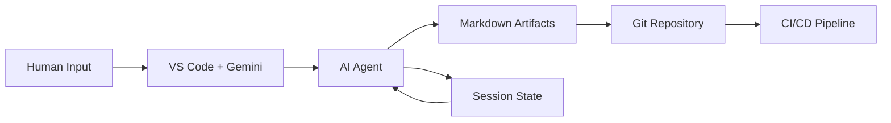
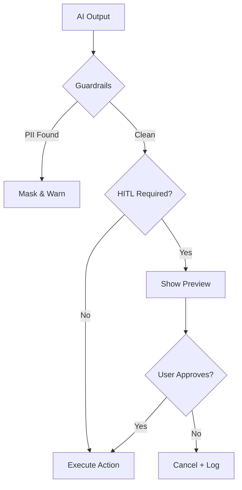

# User Slide Content V2 (Framework-Consistent Edition)

## Slide 1: THE FIVE PILLARS OF AI-AUGMENTED SDLC
*From Static Docs to Living, Agent-Generated Artifacts*

### Pillar 1: VS Code as Home Base
**One environment for everything:**
*   **Gemini Code Assist** – AI pair programmer in the editor
*   **Slash Commands** – `/prd-discover`, `/epic-split`, `/arch-design`
*   **Integrated Terminal** – Run agents directly
*   **Git Integration** – Commit, push, PR without leaving the IDE

### Pillar 2: Documentation as Code
Everything that describes the system lives **in Git, as text**:
*   **`.md` files** – Markdown for all documentation (PRD, Epics, Stories, ADRs)
*   **Version Controlled** – Changes tracked, reviewable in PRs, rollback possible
*   **`.gemini/STYLEGUIDE.md`** – Teaches AI assistants about project conventions

### Pillar 3: Diagrams as Code
Visuals are **generated from text**, not drawn manually:
| Domain | Tool | Output |
|:-------|:-----|:-------|
| **UX** | Mermaid | User Journeys, State Diagrams, Flowcharts |
| **Architecture** | Mermaid (C4), Python Diagrams | System Structure, Infrastructure |
| **Data** | DBML | Entity-Relationship Diagrams |
| **APIs** | OpenAPI | Swagger UI, Client SDKs |

### Pillar 4: Agent-Generated Artifacts
Outputs are **created by AI Agents**, not written from scratch:
*   **PRD Agent** → Generates requirements from stakeholder input
*   **Epic Agent** → Decomposes PRD into vertical slices
*   **Story Agent** → Creates Jira-ready tickets with Gherkin ACs
*   **Architecture Agent** → Produces C4, DBML, OpenAPI from requirements

**Session State:** Agents persist state across sessions (`open_questions.md`, `session_log.md`, `entities.md`).

### Pillar 5: Git Version Control
**Git is the single source of truth:**
*   **All artifacts in one repo** – Docs, diagrams, code, and tests together
*   **Pull Request workflow** – Every change is reviewed (by humans AND AI)
*   **Full history** – Roll back any document to any point in time

## Slide 1.5: AI GOVERNANCE (Built-in Safeguards)
*Automation that enforces best practices — no guidelines to memorize.*

### Guardrails (Automatic)
Every AI output is validated before use:
*   **PII Detection** – Emails, SSNs, credit cards auto-masked
*   **Hallucination Prevention** – Validates file paths actually exist
*   **Output Limits** – Prevents runaway generation (>50K chars)
*   **Schema Validation** – Checks JSON/YAML structure

### Human-in-the-Loop (On-Demand)
Approval gates pause before critical actions:
*   **Save Files** – Preview content before writing to disk
*   **Create Tickets** – Review before pushing to Jira
*   **Deploy** – Confirm before modifying production
*   **Audit Trail** – All decisions logged for compliance

### Prompt-Ops (Version Control for Prompts)
Treat prompts like code:
*   **Registry** – Central catalog (`prompts/registry.json`) with versions
*   **Testing** – Run prompts against test cases before deploying
*   **A/B Comparison** – Compare prompt versions for quality

### Context Management (Automatic)
Smart handling of large documents:
*   **Prioritization** – Load relevant files first
*   **Chunking** – Split by function/class/section
*   **Token Tracking** – Monitor costs, warn at limits
*   **Summarization** – Auto-summarize oversized files

## Slide 2: REQUIREMENTS (The 3-Layer Framework)

### 1. The Framework
Requirements are organized into 3 interlocking layers:
*   **Layer 1: Strategic Vision** - Outcomes not features
*   **Layer 2: Logic & Design** - Functional flows, user experience
*   **Layer 3: Technical Foundation** - Non-functional requirements, data integrity

### 2. The Outputs
| Layer | Artifact Type | Format |
| :--- | :--- | :--- |
| **Layer 1** | Program Requirements Document (PRD) | Markdown |
| **Layer 2** | Epic Definitions & User Stories | Markdown + Gherkin |
| **Layer 2** | Wireframes | PNG/Excalidraw |
| **Layer 3** | Architecture Constraints | ADRs, Diagrams |

### 3. The AI Workflow
**Inputs:** Stakeholder docs, Meeting transcripts, Brainstorming sessions  
**AI Actions:** NotebookLM synthesizes → AI extracts epics → AI generates Gherkin → AI creates wireframes  
**Outputs:** Structured PRD, Epic docs with acceptance criteria, UX flows

## Slide 3: REQUIREMENTS (The States of Information)
**How AI processes information in 3 states:**

*   **(Solid) Documentation – NotebookLM:**
    *   Summarizes existing docs, finds conflicts, extracts topics
    *   Includes regulatory docs, SOPs, legacy code summaries, database schemas
*   **(Liquid) Conversation – AI Transcription:**
    *   Meeting transcripts captured by AI
    *   Real-time synthesis of stakeholder discussions
*   **(Gas) Unspoken Ideas – AI Brainstorming:**
    *   Edge case stress-testing, persona simulation
    *   Mind mapping, form-filling, BDD/Gherkin translation
    *   Requirements traceability automation

## Slide 3.5: EPIC DECOMPOSITION (Vertical Value Streams)

### 1. The Framework: Vertical Slicing
**Two types of epics:**
*   **Business Epics:** User-facing capability that delivers end-to-end value (from PRD functional requirements)
*   **Enabler Epics:** Infrastructure or services needed to support business epics (from Architecture Hub)

**Vertical Slicing Rule:**
*   Every epic cuts through all layers: **UI → API → Database**
*   **Why for AI:** Provides complete context for code generation (user click → data persistence)

**Decomposition Steps:**
1. Identify user outcomes from PRD
2. Map to personas who benefit
3. Define the capability needed (this becomes the epic)
4. Validate it's vertical (spans UI/API/DB)

### 2. The Outputs
| Artifact | Format | Content | Storage |
| :--- | :--- | :--- | :--- |
| **Epic Document** | Markdown | Scope, Success metrics, Dependencies, Story themes | `docs/epics/epic-*.md` |
| **Epic AC** | Gherkin | High-level acceptance criteria | Inside epic doc |
| **Jira Epic** | Jira ticket | Synced from doc | Jira (linked to PRD) |

### 3. The AI Workflow
**Inputs:** PRD (functional requirements) + Architecture Hub (technical constraints)

**AI Actions:**
1. Analyze PRD outcomes → Propose candidate epics (Business + Enabler)
2. Generate scope definition (In Scope / Out of Scope) for review
3. Validate vertical slice (check epic spans UI/API/DB)
4. Extract dependencies (flag enabler epics required first)
5. Sync to Jira with traceability links to PRD

**Outputs:** Epic documents with vertical scope, Jira epics with linked PRD sections

**Live Jira Sync:** Epic docs (markdown) ↔ Jira epics (bi-directional, auto-creates traceability links)

## Slide 3.6: USER STORY ELABORATION (The AI-Ready Prompt Package)

### 1. The Framework: Epic to Stories
**Story Decomposition:**
*   Break epic into small vertical slices (each = 1-3 days of work)
*   Each story delivers testable, end-to-end value (UI → API → DB)

**Decomposition Steps:**
1. Map the user journey for the epic
2. Identify each distinct step or action
3. Turn each step into a story
4. Validate using INVEST criteria (Independent, Negotiable, Valuable, Estimable, Small, Testable)

**Story Planning Session:**
1. Define the user need in one sentence
2. List business rules and constraints
3. Create concrete examples of how it works
4. Convert examples into Gherkin scenarios

### 2. The Outputs
| Artifact | Format | Purpose | Generated By |
| :--- | :--- | :--- | :--- |
| **Story Ticket** | Jira | Complete context for dev + AI | AI scaffolded / Human refined |
| **Gherkin ACs** | `.feature` file | Executable specifications | AI from examples |
| **E2E Test Stub** | Playwright `.spec.ts` | Test automation | AI from Gherkin + Wireframes |
| **Implementation Checklist** | Markdown | Files, APIs, functions to modify | AI from Architecture Hub |

**Story Structure (5 Sections):**
1. **Context Links:** Epic, PRD, API contracts, Data models, Wireframes
2. **Gherkin ACs:** Given/When/Then scenarios
3. **Technical Brief:** Files to modify, API endpoints, Environment vars
4. **AI Collaboration Plan:** Step-by-step AI generation instructions
5. **Manual Validation:** UI aesthetics, accessibility checks

### 3. The AI Workflow
**Inputs:** 
- Parent Epic
- Architecture Hub (API contracts, data models)
- UX Design Hub (wireframes for this story's screens)

**AI Actions:**
1. Generate story ticket structure with context links pre-populated
2. Convert business examples to Gherkin Given/When/Then scenarios
3. Extract implementation details from Architecture Hub (API endpoints, data fields, files)
4. Generate Playwright test stub using Gherkin + Wireframes for semantic selectors
5. Sync to Jira with all artifacts linked

**Outputs:** 
- Jira story (ready for development)
- Gherkin `.feature` file
- Playwright test stub (before code exists)
- Implementation checklist

**Integration Points:**
*   **From Architecture:** API contracts → Technical brief, Data models → Test data
*   **From UX:** Wireframes → Semantic selectors (`getByRole`), Flows → Test scenarios
*   **To Testing:** Gherkin ACs → E2E tests (Dimension 4), Implementation plan → Unit tests (Dimension 2)

**Live Jira Sync:** Story docs ↔ Jira tickets (bi-directional, all context links auto-populated)

## Slide 4.5: UX DESIGN (The UX Architect Framework)

### 1. The Framework: 4-Step Workflow

1.  **Flow Mapping:** Complete user journey (Happy Path + 3 Sad Paths)
2.  **3-Screen Solution:** Key screens optimized for minimum clicks
3.  **Heuristic Evaluation:** Nielsen's 10 principles (rated 1-5)
4.  **Persona Stress-Test:** Simulate users to find friction points

### 2. The Outputs
| Artifact | Format | Purpose |
| :--- | :--- | :--- |
| **User Journey Maps** | Mermaid `journey` | Emotional arc of experience |
| **User Flow Diagrams** | Mermaid `flowchart` | Logical steps and decisions |
| **Wireframes** | PNG/Excalidraw | Visual layout (Mid-Fi) |
| **State Diagrams** | Mermaid `stateDiagram` | Screen states (Loading, Error, etc.) |

### 3. The AI Workflow
**Inputs:** All Epics + PRD + Personas (loaded simultaneously)  
**AI Actions:** Maps flows → Generates wireframes → Evaluates heuristics → Tests with personas  
**Outputs:** User Journeys, Flow Diagrams, Wireframes, State Diagrams

## Slide 4.6: SYSTEM-WIDE UX (The Holistic Advantage)

**The AI Capability:**
*   **Information Architecture:** Consistent navigation across all features
*   **Cross-Epic Flows:** Identifies connections (e.g., "Order Tracking" links to "Checkout")
*   **Design System:** Reusable components used consistently

**The Result:** Cohesive, conflict-free UX in one shot.

## Slide 5: ARCHITECTURE (The Architecture Hub)

### 1. The Framework
The Architecture Hub is a centralized, version-controlled repository of technical contracts covering:
*   **The WHAT:** Diagrams (visual understanding)
*   **The HOW:** API Contracts + Data Models (implementation contracts)
*   **The SAFE/SCALABLE:** IAM, Governance, Resiliency (for later)

### 2. The Outputs - Pillar #1: The 4 Types of Diagrams
| Diagram Type | Tool | Purpose |
| :--- | :--- | :--- |
| **System Structure** | C4 Model (Mermaid) | High-level logical blocks (App, API, DB) |
| **Cloud Anatomy** | Python Diagrams | Physical resources (GCP Cloud Run, Firestore) |
| **Data Structure** | DBML | Entity-Relationship Diagrams (tables, relationships) |
| **Logic Flow** | Sequence Diagrams (Mermaid) | Step-by-step service interactions |

### 3. The AI Workflow
**Inputs:** PRD + Architecture requirements  
**AI Actions:** Reads prompt-hub/ARCH_001-004 → Generates diagrams  
**Outputs:** Mermaid (C4, Sequence), DBML (ERD), Python code (Infrastructure diagrams)

## Slide 6: ARCHITECTURE (Pillars #2 & #3)

### 2. The Outputs (continued)

**Pillar #2: API Contracts**
*   Machine-readable specifications: OpenAPI (REST), .proto files (gRPC)

**Pillar #3: Data Models & Schemas**
*   Database schemas (Cloud SQL), Firestore models, JSON schemas (message queues)

### 3. The AI Workflow
**Inputs:** PRD + Architecture requirements  
**AI Actions:** Uses prompt-hub/ARCH_002-003 → Generates contracts  
**Outputs:** OpenAPI YAML files, DBML schemas, JSON Schema definitions

---

**Comprehensive Base:**
*   The **WHAT** (Diagrams)
*   The **HOW** (API & Data)
*   The **SAFE/SCALABLE** (IAM, Governance, Resiliency) - *for later*

## Slide 6.5: IMPLEMENTATION (The Context-Driven Developer)

### 1. The Framework: AI-Paired Workflow
**Philosophy:** Context-Driven Development (The "Prompt Package" Approach)
*   **The Shift:** Developer moves from "Code Author" to "Reviewer & Architect"
*   **The Input:** Not just a text story, but a pre-assembled context packet (The Prompt Package)
*   **The Environment:** 
    - Development: VS Code + Gemini Code Assist (Chat, Inline, Agent Mode, Code Review)
    - Deployment: Gemini CLI (Cloud Run `/deploy`, Vertex AI MLOps)

### 2. The Outputs
| Artifact | Content | Verified By |
| :--- | :--- | :--- |
| **Test Suite** | Unit tests + E2E Stubs (Playwright) | Automated CI (Vitest/Playwright) |
| **Source Code** | Implementation matching patterns | Linter + Peer Review + Gemini Code Review |
| **Deployed Service** | Cloud Run / Cloud Functions | Gemini CLI deployment |
| **Pull Request** | Context-linked PR description | AI summarizer |

### 3. The AI Workflow
**Inputs:** The Prompt Package (Jira Story + Wireframes + API Contracts + Data Models)

**AI Actions (Development Phase - Code Assist):**
1.  **Scaffold:** Agent Mode creates file structure from Technical Brief
2.  **Test (Red):** Generate failing tests from Gherkin ACs
3.  **Code (Green):** Write code to pass tests using Design System
4.  **Refactor:** Optimize and clean up code

**AI Actions (Deployment Phase - CLI):**
5.  **Deploy:** CLI `/deploy` command (Cloud Run/Functions)
6.  **MLOps:** Deploy models to Vertex AI (if applicable)

**Jira Sync:** Status updates, time logging, and PR linking

---

## Slide 7: TESTING (The 5 Dimensions of Quality)

### 1. The Framework
5 dimensions that span Pre-Code → Production

### 2. The Outputs & 3. The AI Workflow

| Dimension | Input Required | AI Action | Output Generated |
| :--- | :--- | :--- | :--- |
| **1. Simulation** | Personas | Simulate user behaviors, stress-test logic | Persona test reports, edge case findings |
| **2. Components** | Code signatures | Generate unit tests in parallel with code | Vitest tests (80%+ coverage) |
| **3. Contracts** | OpenAPI specs | Generate contract tests + mock servers | Contract test suites, mock APIs |
| **4. Behavior** | Gherkin ACs + Wireframes | Generate semantic Playwright scripts | E2E test scripts (.spec.ts) |
| **5. Resilience** | Usage profiles | Generate load tests, chaos scenarios | k6 scripts, synthetic data, chaos configs |

