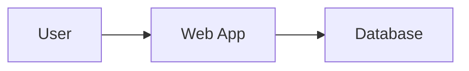
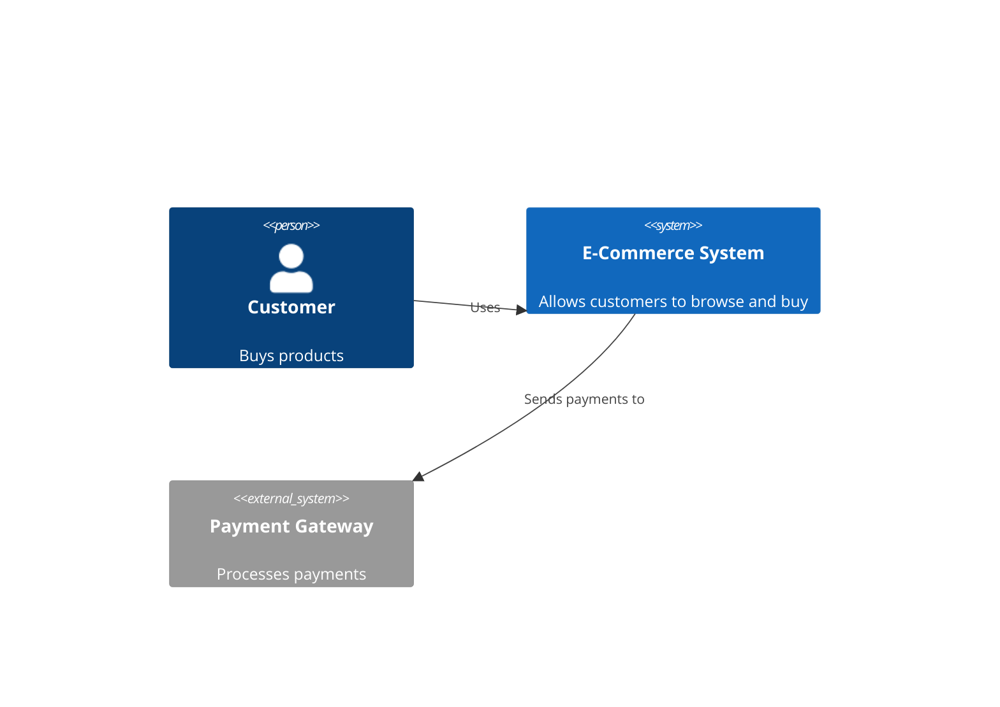

# The AI-Augmented SDLC: A Complete Guide

## About This Document

This guide provides a comprehensive explanation of the AI-Augmented Software Development Lifecycle (SDLC), designed for readers who may not have prior experience with software development methodologies, AI-assisted development, or the specific techniques referenced in this framework.

Every concept is explained from first principles, with real-world examples and practical context.

---

## Table of Contents

1. [Introduction: What is the AI-Augmented SDLC?](#1-introduction-what-is-the-ai-augmented-sdlc)
2. [The Seven Pillars](#2-the-seven-pillars)
3. [Jira Integration](#3-jira-integration)
4. [Requirements: The Three-Layer Framework](#4-requirements-the-three-layer-framework)
5. [Requirements: The States of Information](#5-requirements-the-states-of-information)
6. [Epic Decomposition: Breaking Down Large Features](#6-epic-decomposition-breaking-down-large-features)
7. [User Story Elaboration: Creating Work Packages](#7-user-story-elaboration-creating-work-packages)
8. [UX Design: The UX Architect Framework](#8-ux-design-the-ux-architect-framework)
9. [System-Wide UX: The Holistic Advantage](#9-system-wide-ux-the-holistic-advantage)
10. [Architecture: The Architecture Hub](#10-architecture-the-architecture-hub)
11. [Interfaces: The Four Layers of Integration](#11-interfaces-the-four-layers-of-integration)
12. [Implementation: Context-Driven Development](#12-implementation-context-driven-development)
13. [Testing: The Five Dimensions of Quality](#13-testing-the-five-dimensions-of-quality)
14. [Context Window Management: Getting the Best from AI](#14-context-window-management-getting-the-best-from-ai)

---

## 1. Introduction: What is the AI-Augmented SDLC?

### What is an SDLC?

The **Software Development Lifecycle (SDLC)** is a structured process that describes how software is planned, created, tested, and maintained. Traditional phases include:

- **Requirements** — What should the software do?
- **Design** — How should it be structured?
- **Implementation** — Writing the actual code
- **Testing** — Does it work correctly?
- **Deployment** — Making it available to users
- **Maintenance** — Fixing bugs and adding features

### What Does "AI-Augmented" Mean?

In this framework, **AI is a partner, not a replacement**. Artificial Intelligence (specifically, Large Language Models like Google's Gemini) assists humans at every phase:

| Traditional Approach | AI-Augmented Approach |
|:---------------------|:----------------------|
| Human writes all documents | AI drafts, human reviews and refines |
| Human draws all diagrams | AI generates from text descriptions |
| Human writes all code | AI suggests, human reviews and accepts |
| Human writes all tests | AI generates test cases from requirements |

**The key principle:** AI handles repetitive, time-consuming tasks so humans can focus on creative problem-solving, decision-making, and quality assurance.

### Why Does This Matter?

Studies show that developers spend significant time on repetitive tasks:
- 30-40% on writing boilerplate code
- 20-30% on writing documentation
- 15-20% on writing tests

AI assistance can dramatically reduce this time, allowing teams to:
- Deliver features faster
- Maintain higher quality documentation
- Catch more bugs before production
- Focus on innovation rather than repetition

---

## 2. The Seven Pillars

The AI-Augmented SDLC is built on seven foundational principles that govern how work is organized, tracked, and executed.

### Pillar 1: VS Code as Home Base

**What is VS Code?**

Visual Studio Code (VS Code) is a free, open-source code editor developed by Microsoft. It's the most popular development environment in the world, used by over 70% of professional developers.

**Why is this important?**

Instead of switching between multiple applications (one for writing code, another for documentation, another for chat, etc.), everything happens in one place:

| Capability | What It Does |
|:-----------|:-------------|
| **Gemini Code Assist** | AI assistant embedded in the editor that can answer questions, suggest code, and help debug problems |
| **Slash Commands** | Quick commands (like `/prd-discover`) that trigger AI agents to perform specific tasks |
| **Integrated Terminal** | Command-line interface inside VS Code for running programs and scripts |
| **Git Integration** | Version control built directly into the editor |
| **Jira Integration** | Track tickets and tasks without leaving the editor |

**Practical Example:**

A developer wants to create a new feature. Without leaving VS Code, they can:
1. Read the requirements (markdown file)
2. Ask the AI for clarification (`/prd-discover`)
3. Generate code with AI assistance
4. Run tests in the terminal
5. Commit changes to Git
6. Update the Jira ticket

### Pillar 2: Documentation as Code

**The Traditional Problem:**

Documentation often becomes outdated because:
- It's stored separately from code (in wikis, shared drives, or email)
- There's no review process for changes
- Nobody knows which version is current
- Changes aren't tracked

**The Solution: Treat Documentation Like Code**

All documentation is stored as plain text files (Markdown format) alongside the code in the same repository:

| Document Type | Traditional Storage | Documentation as Code |
|:--------------|:--------------------|:----------------------|
| Requirements (PRD) | Microsoft Word on SharePoint | `docs/PRD.md` in Git |
| Architecture Decisions | Email threads | `docs/decisions/ADR-001.md` in Git |
| API Documentation | Confluence wiki | `docs/api/openapi.yaml` in Git |

**What is Markdown?**

Markdown is a simple text format that uses symbols like `#` for headings and `*` for lists. This document is written in Markdown. Example:

```markdown
# This is a Heading

This is a paragraph with **bold text** and *italic text*.

- This is a bullet point
- This is another bullet point
```

**Why This Matters:**

- **Version Control:** Every change is tracked. You can see who changed what and when.
- **Review Process:** Documentation changes go through the same review process as code changes.
- **Single Source of Truth:** There's never confusion about which version is current.
- **AI Readability:** AI assistants can easily read and understand plain text files.

### Pillar 3: Diagrams as Code

**The Traditional Problem:**

Diagrams (flowcharts, architecture diagrams, etc.) are typically created in tools like Visio, Lucidchart, or PowerPoint. These diagrams:
- Become outdated quickly
- Are difficult to version control (binary files)
- Can't be reviewed in pull requests
- Must be manually updated

**The Solution: Generate Diagrams from Text**

Instead of drawing diagrams, we describe them in text and let tools generate the images automatically:



This text produces a visual diagram showing a User connected to a Web App connected to a Database.

**Tools Used:**

| Purpose | Tool | What It Does |
|:--------|:-----|:-------------|
| **Flowcharts, Journeys** | Mermaid | Text-to-diagram tool built into many platforms |
| **System Architecture** | C4 Model + Mermaid | Standardized way to show system structure |
| **Data Models** | DBML | Text format for database schemas |
| **Infrastructure** | Python Diagrams | Python library that generates cloud architecture diagrams |
| **APIs** | OpenAPI | YAML/JSON format that generates API documentation |

### Pillar 4: Agent-Generated Artifacts

**What is an AI Agent?**

An AI Agent is a specialized AI program designed to perform a specific task. Unlike a general-purpose chatbot, an agent:
- Has a specific job (e.g., "split requirements into epics")
- Uses specialized prompts and templates
- Produces consistent, structured output
- Can integrate with other tools (Jira, Git, etc.)

**The Agents in This Framework:**

| Phase | Agent | What It Does |
|:------|:------|:-------------|
| Requirements | PRD Agent | Helps gather and organize requirements |
| Elaboration | Epic Agent | Breaks large features into manageable pieces |
| Elaboration | Story Agent | Creates detailed work packages for developers |
| UX Design | UX Agent | Creates user personas and wireframes |
| Architecture | Architecture Agent | Generates system diagrams and API specs |
| Testing | Test Plan Agent | Creates test plans and generates test code |

**Human-in-the-Loop (HITL):**

Every agent output is reviewed by a human before it becomes final. The AI drafts, the human approves (or edits and approves).

### Pillar 5: Git Version Control

**What is Git?**

Git is a version control system—a way to track changes to files over time. Think of it like "Track Changes" in Microsoft Word, but for an entire folder of files.

**Key Concepts:**

| Term | What It Means | Analogy |
|:-----|:--------------|:--------|
| **Repository (Repo)** | A folder whose history is tracked | A project folder with infinite undo |
| **Commit** | A snapshot of the entire folder at a point in time | Saving a version |
| **Branch** | A parallel version of the folder | A draft copy for experimenting |
| **Pull Request (PR)** | A request to merge changes from one branch to another | Submitting your draft for review |
| **Merge** | Combining changes from two branches | Accepting edits into the final version |

**Why Git Matters for This Framework:**

- **All artifacts in one repo:** Code, documentation, diagrams, and tests are stored together
- **Everything is reviewable:** Changes go through Pull Requests
- **Full history:** You can roll back any file to any previous version
- **AI can read it:** AI assistants can access the entire project history

### Pillar 6: AI Governance

**The Risk of Uncontrolled AI:**

AI is powerful but imperfect. Without guardrails:
- AI might generate incorrect code
- AI might expose sensitive data
- AI might hallucinate (confidently state incorrect facts)
- Changes might be applied without human review

**The Safeguards:**

| Safeguard | Type | What It Does |
|:----------|:-----|:-------------|
| **Guardrails** | Automatic | Detects PII (personal data), prevents hallucination, limits output size |
| **Human-in-the-Loop** | Always On | Every AI-generated change must be reviewed before it's saved |
| **Prompt Ops** | Automatic | Prompts are versioned and tested like code |
**The Key Principle:** AI never makes changes directly. It always proposes changes that a human must accept.

### Pillar 7: Context Management

**The Challenge:**

Even the largest AI models (2 million tokens) can't fit an entire codebase. Without strategy, AI lacks the context to give good answers.

**The Solution: Multi-Layer Context Strategy**

| Layer | Strategy | What It Does |
|:------|:---------|:-------------|
| **1. Pre-Processing** | NotebookLM | Summarizes bulk documents before development |
| **2. Hierarchical Chunking** | Index → Summary → Detail | Creates navigable document structures |
| **3. Context Drawer** | Code Assist UI | Explicitly include/exclude files for AI |
| **4. Caching** | Vertex AI API | Reuses common context (STYLEGUIDE, glossary) |
| **5. Session State** | SessionStateManager | Persists context across multi-day work |

**Key Principles:**
- **Pre-summarize:** Use NotebookLM for bulk documents
- **Reference, don't embed:** Link to documents instead of copying content
- **Progressive disclosure:** Summary always, details on-demand
- **Session persistence:** Track entities, open questions, next steps

> 📖 **Full Details:** See Chapter 14 for complete context management strategies.

---

## 3. Jira Integration

### What is Jira?

Jira is the most widely used project management tool in software development. It tracks:
- **Epics** — Large features or initiatives
- **Stories** — Individual pieces of work
- **Tasks** — Specific to-do items
- **Bugs** — Problems that need fixing

### The Problem This Solves

In traditional workflows:
- Requirements live in one system (documents)
- Work tracking lives in another system (Jira)
- These systems often get out of sync
- Traceability is manual and error-prone

### The Solution: Bi-Directional Sync

This framework keeps Markdown documents and Jira tickets synchronized automatically:

| When This Happens | Jira Is Updated |
|:------------------|:----------------|
| AI generates an Epic document | A Jira Epic is created automatically |
| AI generates User Stories | Jira Stories are created and linked to the Epic |
| Status changes in Jira | The markdown document is updated |
| Description changes in markdown | The Jira ticket is updated |

### Traceability

Every artifact is linked:

```
PRD Section → Epic → Stories → Test Cases
```

This means:
- You can trace any test back to the original requirement
- You can see all stories that implement a given requirement
- You can identify which requirements are not yet implemented

---

## 4. Requirements: The Three-Layer Framework

### What Are Requirements?

Requirements describe what the software should do. They answer questions like:
- What problem are we solving?
- Who will use this software?
- What features are needed?
- How should it behave?

### The Three Layers

Requirements are organized into three distinct layers:

#### Layer 1: Strategic Vision (The "Why")

This layer focuses on business outcomes, not features:

- What problem are we solving?
- How will we measure success?
- What is the business value?

**Example:**

> ❌ Bad: "We need a login page"
> 
> ✅ Good: "Users must be able to securely access their accounts, reducing support calls by 30%"

**Output:** Program Requirements Document (PRD)

#### Layer 2: Logic & Design (The "What")

This layer describes the user experience and functional flows:

- What will users see and do?
- What are the step-by-step workflows?
- What are the screen layouts?

**Outputs:**
- Epic definitions
- User Stories with acceptance criteria
- Wireframes (visual layouts)

#### Layer 3: Technical Foundation (The "How")

This layer describes the technical constraints and architecture:

- What technology will we use?
- How will data be stored?
- What are the performance requirements?
- What are the security requirements?

**Outputs:**
- Architecture Decision Records (ADRs)
- System diagrams
- API specifications

---

## 5. Requirements: The States of Information

### The Challenge of Gathering Requirements

Requirements information comes from many sources in many forms:

- Existing documents (contracts, regulations, manuals)
- Conversations (meetings, interviews)
- Ideas that haven't been articulated yet

### The Three States of Information

This framework uses a physics analogy to categorize information sources:

#### Solid: Existing Documentation

**What it is:** Written documents that already exist

**Examples:**
- Regulatory documents
- Standard operating procedures
- Existing system documentation
- Database schemas
- Legacy code

**How AI helps:** AI tools like NotebookLM can:
- Summarize long documents
- Find conflicts between documents
- Extract key topics and requirements
- Answer questions about the content

#### Liquid: Conversations

**What it is:** Spoken information that needs to be captured

**Examples:**
- Meeting recordings
- Stakeholder interviews
- Workshop discussions

**How AI helps:**
- Transcribe audio to text automatically
- Summarize key points
- Extract action items and decisions
- Identify topics mentioned

#### Gas: Unspoken Ideas

**What it is:** Requirements that haven't been articulated yet—ideas that need to be discovered

**Examples:**
- Edge cases nobody thought about
- Assumptions that need to be validated
- "What if" scenarios

**How AI helps:**
- Mind mapping (exploring related concepts)
- Persona simulation ("What would a frustrated user do?")
- Edge case stress-testing
- Roleplay scenarios

---

## 6. Epic Decomposition: Breaking Down Large Features

### What is an Epic?

An **Epic** is a large body of work that can be broken down into smaller pieces. Think of it as a major feature or capability.

**Examples:**
- "User Registration and Login"
- "Shopping Cart and Checkout"
- "Reporting Dashboard"

### Why Break Down Epics?

Large features are difficult to:
- Estimate accurately
- Complete in a reasonable timeframe
- Test comprehensively
- Deliver incrementally

Breaking them down allows teams to:
- Deliver value faster (smaller pieces = faster delivery)
- Get feedback earlier
- Reduce risk (problems are caught sooner)
- Estimate more accurately

### Two Types of Epics

#### Business Epics (What Users See)

These deliver functionality directly to end users:
- Derived from the PRD's functional requirements
- Provide end-to-end user value
- Example: "Allow users to submit insurance claims online"

#### Enabler Epics (What Makes It Work)

These build the infrastructure needed by Business Epics:
- Derived from technical requirements
- Don't deliver direct user value, but are necessary
- Example: "Build the claims processing API"

### Vertical Slicing

**The Principle:** Each Epic should cut through all layers of the system (UI, API, Database) rather than being limited to one layer.

**Why This Matters:**

| Horizontal Slice (Bad) | Vertical Slice (Good) |
|:-----------------------|:----------------------|
| "Build the claims database" | "Submit a simple claim end-to-end" |
| Only addresses one layer | Addresses all layers |
| Can't be tested by users | Can be tested and demoed |
| No visible value | Delivers visible value |

### The SPIDR Framework

SPIDR is a methodology developed by Agile expert Mike Cohn for splitting large Epics into smaller pieces. Each letter represents a different splitting strategy:

#### S — Spike

**When to use:** When there's too much uncertainty to estimate

**What it means:** Separate the research from the implementation

**Example:**
- Original: "Integrate with payment gateway"
- Split into:
  - Spike: "Evaluate payment gateway options" (research)
  - Implementation: "Integrate with Stripe" (actual work)

#### P — Path

**When to use:** When a feature has multiple user journeys or scenarios

**What it means:** Handle the "happy path" first, then handle error cases

**Example:**
- Original: "Submit insurance claim"
- Split into:
  - "Submit simple claim successfully" (happy path)
  - "Handle claim rejection" (error path)
  - "Handle missing documents" (error path)

#### I — Interface

**When to use:** When a feature must work on multiple platforms

**What it means:** Start with one platform, add others later

**Example:**
- Original: "Mobile checkout"
- Split into:
  - "Web checkout"
  - "iOS checkout"
  - "Android checkout"

#### D — Data

**When to use:** When a feature handles multiple data types or sources

**What it means:** Start with one data type, add others later

**Example:**
- Original: "Import customer data"
- Split into:
  - "Import customer data from CSV"
  - "Import customer data from API"
  - "Import customer data from database"

#### R — Rules

**When to use:** When requirements have complex business rules

**What it means:** Start with simple rules, add complexity later

**Example:**
- Original: "Calculate insurance premium"
- Split into:
  - "Calculate premium for single driver"
  - "Calculate premium for multiple drivers"
  - "Calculate premium with discounts"

### The INVEST Criteria

Each Epic (and Story) should pass the INVEST test:

| Letter | Criterion | What It Means |
|:-------|:----------|:--------------|
| **I** | Independent | Can be developed without depending on other work |
| **N** | Negotiable | Details can be adjusted during development |
| **V** | Valuable | Delivers clear business value |
| **E** | Estimable | Team can estimate the size |
| **S** | Small | Can be completed in a reasonable time |
| **T** | Testable | Clear criteria for "done" |

---

## 7. User Story Elaboration: Creating Work Packages

### What is a User Story?

A **User Story** is a small piece of functionality that delivers value to a user. It's the smallest unit of work that developers implement.

**Traditional Format:**
> As a [type of user], I want [some goal] so that [some reason].

**Example:**
> As a customer, I want to view my order history so that I can track my purchases.

### The "Prompt Package" Concept

In this framework, a User Story is more than just a description—it's a complete "prompt package" that contains everything an AI needs to help implement it.

**Why This Matters:**

AI coding assistants work best when they have complete context. A story that says "Add login" gives the AI almost nothing to work with. A story with:
- Link to the API specification
- Link to the data model
- Link to the wireframe
- Specific acceptance criteria

...gives the AI enough context to generate useful code.

### The Five Sections of an AI-Ready Story

#### Section 1: Context & Links

Links to all related documents:
- Parent Epic
- PRD section
- API contracts
- Data models
- Wireframes

#### Section 2: Gherkin Acceptance Criteria

**What is Gherkin?**

Gherkin is a structured language for writing acceptance criteria. It uses a "Given-When-Then" format that is:
- Understandable by non-technical stakeholders
- Precise enough to be automated
- Used by testing tools (Cucumber, Playwright)

**The Given-When-Then Structure:**

| Keyword | Purpose | Example |
|:--------|:--------|:--------|
| **Given** | The starting condition | "Given I am logged in as an admin" |
| **When** | The action taken | "When I click the 'Delete User' button" |
| **Then** | The expected result | "Then the user should be removed from the system" |

**Complete Example:**

```gherkin
Given I am a logged-in customer
  And I have 3 items in my shopping cart
When I click the "Checkout" button
Then I should see the payment page
  And my cart items should be displayed
  And the total should be calculated correctly
```

**Why Gherkin Matters:**

1. **Unambiguous:** Forces precise language
2. **Testable:** Can be directly converted to automated tests
3. **Shared Understanding:** Business and technical teams use the same language
4. **AI-Ready:** AI can generate test code from Gherkin

#### Section 3: Technical Implementation Plan

A checklist of what needs to be built:
- Files to create or modify
- API endpoints to call
- Database tables to use
- Functions to implement

#### Section 4: AI Collaboration Plan

Specific instructions for how the developer should work with AI:
1. "Ask AI to generate the component structure"
2. "Review and adjust the generated code"
3. "Ask AI to generate unit tests"

#### Section 5: Manual Validation Steps

Things that must be checked by a human:
- Visual appearance
- Animation smoothness
- Accessibility (screen readers, keyboard navigation)
- "Feel" of the user experience

---

## 8. UX Design: The UX Architect Framework

### What is UX Design?

**User Experience (UX) Design** is the process of designing products that are easy to use, efficient, and enjoyable. It encompasses:
- How screens are laid out
- How users navigate between screens
- What users feel when using the product
- How errors are handled

### The Four-Step UX Workflow

This framework uses a structured four-step process:

#### Step 1: Flow Mapping

**What it is:** Documenting the complete user journey

**What it includes:**
- The "Happy Path" — What happens when everything goes right
- 3+ "Sad Paths" — What happens when things go wrong

**Example for "User Registration":**

| Path Type | Description |
|:----------|:------------|
| Happy Path | User enters valid info, clicks submit, account created |
| Sad Path 1 | Email already exists — show error, suggest login |
| Sad Path 2 | Password too weak — show requirements, let user retry |
| Sad Path 3 | Server error — show friendly message, offer retry |

#### Step 2: 3-Screen Solution

**The Principle:** Achieve the goal in the fewest possible screens

**Why This Matters:**
- Each additional screen is a chance for users to abandon the process
- Simpler flows have fewer bugs
- Less development effort

**Example:**

| Task | Traditional Approach | 3-Screen Approach |
|:-----|:---------------------|:------------------|
| Place an order | 7 screens | 3 screens (cart → payment → confirmation) |

#### Step 3: Heuristic Evaluation

**What is a Heuristic?**

A heuristic is a rule of thumb or best practice. In UX, we use Jakob Nielsen's 10 Usability Heuristics as a checklist:

| # | Heuristic | What It Means |
|:--|:----------|:--------------|
| 1 | Visibility of system status | Users should always know what's happening |
| 2 | Match between system and real world | Use language users understand |
| 3 | User control and freedom | Allow undo and cancel |
| 4 | Consistency and standards | Same action = same result everywhere |
| 5 | Error prevention | Prevent errors before they happen |
| 6 | Recognition rather than recall | Show options, don't make users remember |
| 7 | Flexibility and efficiency | Allow shortcuts for experts |
| 8 | Aesthetic and minimalist design | Remove unnecessary elements |
| 9 | Help users recognize, diagnose, and recover from errors | Clear error messages |
| 10 | Help and documentation | Provide guidance when needed |

Each screen is rated 1-5 on each heuristic.

#### Step 4: Persona Stress-Test

**What is a Persona?**

A persona is a fictional representation of a user type. Each persona has:
- A name and background
- Goals and motivations
- Pain points and frustrations
- Technical skill level

**Example Personas:**

| Persona | Description | Stress-Test Focus |
|:--------|:------------|:------------------|
| "Sarah the Rushed Parent" | Busy, distracted, using mobile while cooking | Can she complete the task quickly? |
| "Tom the Technophobe" | Older, intimidated by technology | Are the instructions clear enough? |
| "Alex the Power User" | Tech-savvy, wants efficiency | Are there shortcuts available? |

**The AI Role:**

AI can simulate these personas, asking questions like:
- "As Sarah, I'm confused by this button—what does it do?"
- "As Tom, I don't understand what 'authenticate' means"

---

## 9. System-Wide UX: The Holistic Advantage

### The Problem with Feature-by-Feature UX

When different teams design features independently:
- Navigation patterns differ between features
- Terminology is inconsistent
- Users have different experiences in different parts of the app

### The AI Advantage

AI can analyze the entire system simultaneously:

| Capability | What It Does | Benefit |
|:-----------|:-------------|:--------|
| **Information Architecture** | Ensures consistent navigation | Users always know where to find things |
| **Cross-Epic Flows** | Identifies connections between features | No orphaned or disconnected features |
| **Design System Compliance** | Checks that components are used consistently | Same button looks the same everywhere |

### The Result

Instead of designing UX one feature at a time, the AI considers the entire product and ensures everything works together coherently.

---

## 10. Architecture: The Architecture Hub

### What is Software Architecture?

**Software Architecture** describes the structure of a software system:
- What components exist
- How they communicate
- Where data is stored
- How the system is deployed

### The Architecture Hub Concept

The Architecture Hub is a centralized repository of technical decisions and specifications. It answers three questions:

#### The WHAT: Diagrams

Visual representations of the system structure.

**The C4 Model:**

The C4 Model (created by Simon Brown) provides four levels of diagrams, each at a different zoom level:

| Level | Name | Audience | What It Shows |
|:------|:-----|:---------|:--------------|
| 1 | **Context** | Everyone | How the system fits into the world (users, external systems) |
| 2 | **Container** | Technical | What deployable units exist (web app, database, API) |
| 3 | **Component** | Developers | What components exist within a container |
| 4 | **Code** | Developers | Class diagrams, detailed code structure |

**Example Context Diagram (Level 1):**



This shows:
- A Customer interacts with
- The E-Commerce System, which communicates with
- An external Payment Gateway

**Other Diagram Types:**

| Purpose | Tool | What It Shows |
|:--------|:-----|:--------------|
| Database structure | DBML | Tables, columns, relationships |
| Infrastructure | Python Diagrams | Cloud resources (servers, databases, networking) |
| Behavior | Sequence Diagrams | Step-by-step message flows |

#### The HOW: Contracts

Machine-readable specifications that describe exactly how components communicate.

**API Contracts (OpenAPI):**

OpenAPI (formerly Swagger) is a standard format for describing REST APIs:
- What endpoints exist
- What data they accept
- What data they return
- What errors can occur

**Data Models (DBML):**

DBML (Database Markup Language) describes database tables:
- What tables exist
- What columns each table has
- How tables are related

**Why Contracts Matter:**

- Developers on different teams can work in parallel
- AI can generate code from contracts
- Tests can validate that code matches contracts
- Documentation is always up-to-date

#### The WHY: Architecture Decision Records (ADRs)

**What is an ADR?**

An ADR documents an important architectural decision:
- What was decided
- Why it was decided
- What alternatives were considered
- What the consequences are

**Example ADR:**

```markdown
# ADR-001: Use PostgreSQL for the primary database

## Status
Accepted

## Context
We need a database for the e-commerce platform.
Options considered: PostgreSQL, MySQL, MongoDB

## Decision
Use PostgreSQL

## Consequences
- Pro: Strong consistency, complex queries, JSON support
- Con: Requires more operational expertise than MongoDB
```

**Why ADRs Matter:**
- Future developers understand why decisions were made
- Prevents re-debating the same decisions
- Documents trade-offs explicitly

---

## 11. Interfaces: The Four Layers of Integration

### What is an Interface?

An **Interface** is any point where our system connects to another system:
- APIs we call (outbound)
- APIs others call (inbound)
- Files we receive
- Files we send
- Events we publish or subscribe to

### Why Interfaces Matter

Most software bugs occur at system boundaries. If interfaces aren't well-documented and tested:
- Systems fail when external systems change
- Data gets corrupted during transfer
- Performance degrades due to unexpected load

### The Four Layers of Interface Management

#### Layer 1: Context (Visualization)

**What:** A visual map showing ALL external connections

**When:** During requirements and architecture

**Output:** C4 Context Diagram showing:
- Our system
- All external systems
- The connections between them

#### Layer 2: Catalog (Inventory)

**What:** A master list of ALL interfaces

**When:** During Epic decomposition

**Output:** Interface Catalog table:

| ID | External System | Type | Direction | Protocol | Frequency |
|:---|:----------------|:-----|:----------|:---------|:----------|
| INT-001 | Payment Gateway | API | Outbound | REST | Real-time |
| INT-002 | Claims Provider | File | Inbound | SFTP | Daily |
| INT-003 | Accounting | Event | Outbound | Pub/Sub | Real-time |

#### Layer 3: Specification (Details)

**What:** Detailed specification for each interface

**When:** During story writing and architecture

**Output:** Interface spec documents including:
- Endpoint URLs or file paths
- Data formats
- Authentication methods
- Error handling
- Example request/response

**Example for an API Interface:**

| Attribute | Value |
|:----------|:------|
| **Base URL** | `https://api.payment.com/v2` |
| **Auth** | OAuth 2.0 |
| **Rate Limit** | 100 req/min |
| **Retry Policy** | 3 attempts with exponential backoff |

**Example for a File Interface:**

| Attribute | Value |
|:----------|:------|
| **Protocol** | SFTP |
| **Directory** | `/outbound/claims/` |
| **Filename Pattern** | `CLAIMS_YYYYMMDD_HHMMSS.csv` |
| **Frequency** | Daily at 2:00 AM |
| **Format** | CSV, pipe-delimited |

#### Layer 4: Testing (Validation)

**What:** Automated tests that verify interfaces work correctly

**When:** During testing phase

**Output:**
- **Contract Tests** — Verify our code matches the interface specification
- **Mock Servers** — Simulate external systems for testing
- **Schema Validation** — Verify file formats are correct

---

## 12. Implementation: Context-Driven Development

### The Shift in Developer Role

| Traditional Development | Context-Driven Development |
|:------------------------|:---------------------------|
| Developer writes all code | Developer reviews AI-generated code |
| Developer memorizes patterns | AI applies patterns from Architecture Hub |
| Developer writes tests after code | AI generates tests before/during coding |

### The "Prompt Package" Approach

Instead of a vague task like "implement login," the developer receives a complete package:

1. **Jira Story** — What to build
2. **Wireframes** — What it should look like
3. **API Contracts** — How to communicate with backend
4. **Data Models** — What data to store/retrieve
5. **Gherkin ACs** — How to verify it works

This package gives the AI enough context to generate accurate, useful code.

### The AI-Assisted Development Workflow

#### Red-Green-Refactor (Test-Driven Development)

This is a proven methodology for writing high-quality code:

| Phase | What Happens | AI Role |
|:------|:-------------|:--------|
| **Red** | Write a failing test | AI generates tests from Gherkin |
| **Green** | Write minimum code to pass | AI suggests implementation |
| **Refactor** | Improve code quality | AI identifies improvements |

**The Flow:**

1. **AI generates test** from Gherkin acceptance criteria
2. Test fails (because the feature doesn't exist yet)
3. **AI generates code** to make the test pass
4. Developer reviews and accepts the code
5. All tests pass
6. **AI suggests refactoring** to improve code quality
7. Developer reviews and accepts changes

### Human-in-the-Loop

**Critical Principle:** AI never commits code directly. Every change is:
1. Proposed by AI
2. Shown as a "diff" (comparison of old vs. new)
3. Reviewed by developer
4. Accepted or rejected by developer
5. Only then saved to file

---

## 13. Testing: The Five Dimensions of Quality

### The Testing Pyramid

Traditional testing anti-patterns put most effort into slow, expensive manual testing. The Testing Pyramid inverts this:

```
        /\
       /  \
      / E2E \          ← Few, focused end-to-end tests
     /--------\
    /Integration\      ← More integration tests
   /--------------\
  /     Unit       \   ← Many fast unit tests
 /------------------\
```

**The Principle:** Invest most effort in fast, cheap tests (unit tests). Reserve expensive tests (E2E) for critical paths only.

### Testing is Continuous

In the AI-Augmented SDLC, testing happens throughout development, not just at the end:

| When | What Testing Happens |
|:-----|:---------------------|
| During Requirements | Persona simulation (edge cases) |
| During Story Writing | Gherkin ACs (behavior specs) |
| During Architecture | Contract tests (API specs) |
| During Implementation | Unit tests (TDD) |
| Before Release | Load tests, chaos tests |

### The Five Dimensions of Quality

#### Dimension 1: Simulation (Persona Testing)

**What it is:** AI simulates user personas to find edge cases

**When:** During requirements

**Example:** 
- AI acts as "Sarah the Rushed Parent"
- Tries to complete tasks quickly
- Reports confusion points and friction

#### Dimension 2: Components (Unit Testing)

**What it is:** Testing individual functions in isolation

**When:** During implementation

**Tools:** pytest (Python), Vitest (JavaScript)

**AI Role:** Generates unit tests from code and specifications

#### Dimension 3: Contracts (Integration Testing)

**What it is:** Testing that components communicate correctly

**When:** During architecture/implementation

**Tools:** OpenAPI validators, Pact (contract testing)

**AI Role:** Generates contract tests from API specifications

#### Dimension 4: Behavior (End-to-End Testing)

**What it is:** Testing complete user journeys in a real browser

**When:** During story development

**Tools:** Playwright (browser automation)

**AI Role:** Generates Playwright tests from Gherkin acceptance criteria

**Example:**

Gherkin:
```gherkin
Given I am logged in as a customer
When I add an item to my cart
Then the cart count should increase by 1
```

AI-generated Playwright:
```javascript
test('add to cart increases count', async ({ page }) => {
  await loginAsCustomer(page);
  await page.getByRole('button', { name: 'Add to Cart' }).click();
  await expect(page.getByTestId('cart-count')).toHaveText('1');
});
```

#### Dimension 5: Resilience (Performance & Chaos Testing)

**What it is:** Testing how the system behaves under stress

**When:** Before release

**Types:**

| Test Type | What It Does |
|:----------|:-------------|
| **Load Testing** | Simulates many users at once |
| **Stress Testing** | Finds the breaking point |
| **Spike Testing** | Simulates sudden traffic surges |
| **Chaos Testing** | Randomly breaks things to test recovery |

**Tools:** k6, Locust (load testing), Chaos Mesh (chaos engineering)

**AI Role:** Generates load test scripts from API specs

### Test Data Management

**The Challenge:** Tests need data to run against, but sharing data between tests causes problems.

**The Solution:**

| Strategy | What It Means |
|:---------|:--------------|
| **Ephemeral Environments** | Each test run gets a fresh, isolated database |
| **Seed Data** | Predefined test data is loaded automatically |
| **Dynamic Data** | Tests create their own data and clean up after |

**Golden Rule:** Tests never share mutable state.

### When to Test Manually

Not everything should be automated:

| Test Type | Why Manual | How Often |
|:----------|:-----------|:----------|
| **UX Feel** | Animations, transitions, "polish" | Every sprint |
| **Exploratory** | Finding unexpected bugs | 2-3 hours per sprint |
| **Accessibility** | Screen reader, keyboard navigation | Before release |
| **Usability Studies** | Watching real users | Per major feature |

**Philosophy:** Automate the repetitive. Humanize the creative.

---

## Conclusion

The AI-Augmented SDLC is not about replacing developers with AI. It's about:

1. **Eliminating repetitive work** — AI handles boilerplate, documentation
2. **Improving consistency** — Same patterns, same templates everywhere
3. **Accelerating feedback** — Errors caught earlier, delivered faster
4. **Enhancing quality** — More testing, better documentation
5. **Preserving human judgment** — Every AI output is reviewed

The framework works because it combines:
- **Structure** (clear phases, defined outputs)
- **Automation** (AI agents for repetitive tasks)
- **Governance** (human review, version control)
- **Integration** (everything connected: docs, code, tests, tickets)

This is the future of software development: humans and AI working together, each doing what they do best.

---

## Glossary

| Term | Definition |
|:-----|:-----------|
| **ADR** | Architecture Decision Record — Documented architectural decision |
| **BDD** | Behavior-Driven Development — Writing tests as specifications |
| **C4 Model** | Four-level architecture visualization (Context, Container, Component, Code) |
| **DBML** | Database Markup Language — Text format for database schemas |
| **Epic** | Large body of work that can be broken into smaller stories |
| **Gherkin** | Structured language for acceptance criteria (Given/When/Then) |
| **Git** | Version control system for tracking file changes |
| **HITL** | Human-in-the-Loop — Requiring human approval for AI actions |
| **INVEST** | Criteria for good stories (Independent, Negotiable, Valuable, Estimable, Small, Testable) |
| **Mermaid** | Text-to-diagram tool |
| **OpenAPI** | Standard format for API documentation |
| **PRD** | Program Requirements Document |
| **SPIDR** | Epic splitting framework (Spike, Path, Interface, Data, Rules) |
| **SDLC** | Software Development Lifecycle |
| **Story** | Small unit of work delivering user value |
| **UX** | User Experience — The overall experience of using a product |
| **Wireframe** | Low-fidelity visual representation of a screen layout |
| **Context Window** | The maximum amount of text an AI model can process at once |
| **RAG** | Retrieval Augmented Generation — Fetching relevant information before AI generation |
| **Token** | The basic unit of text that AI models process (roughly 4 characters) |

---

## 14. Context Window Management: Getting the Best from AI

### What is a Context Window?

When you communicate with an AI assistant like Gemini, the AI can only "see" a limited amount of text at once. This limit is called the **context window**.

**Analogy:** Think of it like the AI's short-term memory. Just like you can only keep so many things in mind at once, an AI can only consider so much text in a single interaction.

### Current Context Window Sizes (2025)

| Model | Context Window | Equivalent |
|:------|:---------------|:-----------|
| **Gemini 2.0 Pro** | 2 million tokens | ~100,000 lines of code |
| **Gemini 2.0 Flash** | 1 million tokens | ~50,000 lines of code |
| **Gemini Flash (Code Assist chat)** | 32,000 tokens | ~1,600 lines of code |
| **Gemini Flash (auto-complete)** | 8,000 tokens | ~400 lines of code |

**What is a Token?**

A token is approximately 4 characters of English text. The word "context" is 2 tokens. A typical line of code is 15-20 tokens.

### Why Context Management Matters

**The Problem:**

Even with 1 million tokens, you can't fit everything into a single prompt:
- A medium-sized codebase: 500,000+ tokens
- All documentation: 100,000+ tokens
- Full architecture specs: 50,000+ tokens

**The Larger the Context:**
- ✅ More accurate AI responses (more information available)
- ❌ Slower responses (more text to process)
- ❌ Higher costs (charged per token)
- ❌ Risk of "lost in the middle" (AI may miss information in the middle of long contexts)

### The Multi-Layer Context Strategy

This framework uses a four-layer approach to manage context effectively:

#### Layer 1: Pre-Processing (NotebookLM)

**What it does:** Converts large documents into digestible summaries before they enter the development workflow.

**Best for:**
- Regulatory documents
- Existing system documentation
- Meeting transcripts
- Legacy code analysis

**Process:**
```
Large Document (10,000+ tokens)
        ↓
    NotebookLM
        ↓
Summary Document (500-1,000 tokens)
        ↓
Saved to docs/context/
```

**Example:**
- Input: 50-page regulatory compliance document
- Output: 2-page summary with key requirements, stored as `docs/context/compliance-summary.md`

#### Layer 2: Hierarchical Chunking

**What it does:** Breaks large documents into a hierarchy of summaries and details.

**The Structure:**

| Level | Size | Purpose | Example |
|:------|:-----|:--------|:--------|
| **Index** | 200-500 tokens | Navigation and overview | Table of contents with 1-line summaries |
| **Summary** | 500-2,000 tokens | Quick reference | Key points from a section |
| **Detail** | 2,000-10,000 tokens | Deep dive | Full section content |

**Example for Architecture Documentation:**

```
docs/architecture/
├── index.md              # 300 tokens: "Auth is in auth-flow.md, Data model in data-model.md..."
├── summaries/
│   ├── auth-summary.md   # 1,000 tokens: Key auth concepts
│   └── data-summary.md   # 800 tokens: Key data concepts
└── details/
    ├── auth-flow.md      # 5,000 tokens: Complete auth specification
    └── data-model.md     # 8,000 tokens: Full DBML schema
```

**How it's used:**
1. AI always receives the **index** (small)
2. AI receives **summaries** for relevant sections
3. AI fetches **details** only when needed for specific tasks

#### Layer 3: Context Drawer (Code Assist Feature)

**What it is:** A feature in Gemini Code Assist that lets you explicitly control which files the AI can see.

**Available since:** April 2025

**How to use it:**

| Action | Result |
|:-------|:-------|
| **Add files** | Drag specific files into the context drawer |
| **Add folders** | Include entire directories (e.g., `docs/api/`) |
| **Exclude paths** | Remove irrelevant directories (e.g., `node_modules/`, `dist/`) |
| **View context** | See exactly what information the AI has access to |

**Best Practice:** Create context profiles for different types of work:

```
.gemini/context-profiles/
├── architecture-work.txt    # Files needed for architecture tasks
├── frontend-work.txt        # Files for UI development
├── api-work.txt             # Files for API development
└── testing-work.txt         # Files for test writing
```

#### Layer 4: Context Caching

**What it is:** A way to reuse common context across multiple AI requests without resending it each time.

**Types of Caching:**

| Type | How It Works | Best For |
|:-----|:-------------|:---------|
| **Implicit** | Automatic, no action needed | Repeated queries in same session |
| **Explicit** | You declare what to cache | Large system instructions, standard docs |

**Benefits:**
- Faster responses (cached content doesn't need reprocessing)
- Lower costs (cached tokens are cheaper)
- Consistent context across many queries

**What to Cache:**

| Document Type | Why Cache It |
|:--------------|:-------------|
| **STYLEGUIDE.md** | Referenced in every AI interaction |
| **Architecture Summary** | Provides critical context for all code |
| **Glossary** | Ensures consistent terminology |
| **API Index** | Needed for most implementation work |

### Practical Strategies

#### Strategy 1: Progressive Disclosure

**Principle:** Start with summaries, provide details only when needed.

**Example Workflow:**

```
Step 1: AI receives architecture-summary.md (500 tokens)
Step 2: User asks about authentication
Step 3: AI receives auth-flow.md (5,000 tokens) — on demand
Step 4: AI generates authentication code with full context
```

**Why it works:**
- Most queries don't need full context
- Details are loaded only when relevant
- Reduces cost and latency

#### Strategy 2: Reference Linking

**Instead of embedding full content:**

```markdown
# Story: User Login
<full OpenAPI spec - 2,000 tokens>
<full data model - 1,500 tokens>
<full wireframe description - 800 tokens>
```

**Use references:**

```markdown
# Story: User Login
- API Contract: [auth-api.yaml](file://docs/api/auth-api.yaml) — see POST /api/auth/login (lines 45-78)
- Data Model: [users.dbml](file://docs/data/users.dbml) — see User table
- Wireframe: [login-screen.md](file://docs/ux/wireframes/login-screen.md)
```

**Why it works:**
- Story stays small (200 tokens instead of 4,300)
- AI can fetch details when needed
- Documents stay up-to-date (no copy/paste drift)

#### Strategy 3: Semantic Chunking with Metadata

**Add metadata to each chunk for better retrieval:**

```markdown
---
id: ARCH-001-auth
title: Authentication Flow
summary: OAuth2 with Keycloak integration, JWT tokens, refresh handling
keywords: [auth, oauth, keycloak, jwt, token, login, logout]
parent: architecture-summary.md
related: [user-data-model.md, api-auth-endpoints.md]
tokens: ~5000
---

# Authentication Flow
[Full content here]
```

**Why it works:**
- AI can find relevant chunks by keywords
- Parent/related links enable navigation
- Token count helps with budget planning

#### Strategy 4: Task-Specific Context Assembly

**Match context to the task:**

| Task Type | Context Included |
|:----------|:-----------------|
| **Story Implementation** | Story doc, relevant API endpoints, relevant UI components, test patterns |
| **Architecture Review** | Architecture summary, relevant C4 diagrams, ADRs |
| **Bug Investigation** | Error logs, related code files, test results |
| **Test Writing** | Story Gherkin, API specs, existing test patterns |

**Example Context Assembly:**

```
Task: Implement "Add to Cart" story

Context Package:
├── STYLEGUIDE.md           (always included)
├── glossary.md             (always included)
├── stories/add-to-cart.md  (the task)
├── api/cart-endpoints.yaml (relevant API)
├── components/CartItem.tsx (relevant component)
└── tests/cart.spec.ts      (existing test patterns)

Total: ~8,000 tokens (fits in auto-complete context)
```

### Recommended Document Structure

Organize your documentation to support efficient context management:

```
docs/
├── context/                          # Pre-computed summaries (Layer 1)
│   ├── architecture-summary.md       # 500-1,000 tokens
│   ├── api-index.md                  # Links + 1-line descriptions
│   ├── data-model-summary.md         # Key entities, relationships
│   └── glossary.md                   # Domain terms
│
├── architecture/                     # Hierarchical chunks (Layer 2)
│   ├── index.md                      # Table of contents
│   ├── summaries/                    # Section summaries
│   │   ├── auth-summary.md
│   │   └── data-summary.md
│   └── details/                      # Full specifications
│       ├── auth-flow.md
│       └── data-model.md
│
├── api/                              # Chunked by resource
│   ├── index.md                      # All endpoints listed
│   └── endpoints/
│       ├── auth.yaml
│       ├── cart.yaml
│       └── orders.yaml
│
└── .gemini/
    └── context-profiles/             # Context Drawer profiles (Layer 3)
        ├── frontend-work.txt
        └── api-work.txt
```

### Key Principles

| Principle | What It Means |
|:----------|:--------------|
| **Pre-summarize** | Use NotebookLM to condense bulk documents |
| **Index everything** | Create index files that link to details |
| **Chunk semantically** | Break by meaning, not arbitrary size |
| **Add metadata** | Include summaries, keywords, relationships |
| **Use the Context Drawer** | Explicitly control what AI sees |
| **Cache common context** | Reduce latency and cost for frequent docs |
| **Progressive disclosure** | Load details only when needed |
| **Reference, don't embed** | Link to documents instead of copying content |

### Session State Management

Beyond managing what goes into a single AI prompt, this framework also addresses **multi-session context**—remembering what happened across multiple conversations over days or weeks.

**The Challenge:**

Real SDLC work spans multiple sessions:
- A PRD might be written over 3-4 sessions across 2 weeks
- An epic decomposition might involve multiple discussions
- Story refinement happens iteratively

Without session management, each AI conversation starts fresh with no memory of previous work.

**The Solution: Persistent Memory Per Artifact**

This framework includes a `SessionStateManager` (see `standards/session_state_manager.py`) that tracks:

| What's Tracked | Example |
|:---------------|:--------|
| **Session Log** | "Nov 3: Completed Scope Boundaries section with PRD Agent" |
| **Entity Registry** | Domain entities discovered (Users, Orders, Products) |
| **Document Versions** | Git commits for each artifact revision |
| **Next Steps** | "Continue with System Impact section" |
| **Pending Reviews** | "Awaiting stakeholder approval on Business Intent" |

**How It Works:**

```
Session 1 (Day 1):
  - User works on PRD sections 1-3
  - Agent logs: sections completed, entities found, open questions
  - Saved to session_log.md

Session 2 (Day 3):
  - User returns: "Let's continue the PRD"
  - Agent reads session_log.md
  - Agent: "Welcome back! Last time you completed sections 1-3.
           You were starting section 4. Ready to continue?"
```

**Session Log Structure:**

```markdown
## Session 2024-11-03 14:30
**Agent:** PRD Collaborator
**Tools Run:** Business Intent Analysis, Scope Boundaries
**Key Outcomes:**
- Completed section 3 (Scope Boundaries)
- Identified 3 new entities: User, Portfolio, ETF
- Open question: Integration with market data provider
**Open Questions Added:** 1

---
```

**Entity Registry:**

Entities discovered during requirements are tracked and can be injected into future prompts:

| Entity | Discovered In | CRUD | States | Notes |
|:-------|:--------------|:-----|:-------|:------|
| User | PRD Section 1 | CRUD | Active, Suspended | Core entity |
| Portfolio | PRD Section 2 | CRU | Draft, Published | Links to User |
| ETF | Epic EPA-001 | R | N/A | External data source |

> 📖 **Further Reading:** See `ai-agent-recommendation-and-workflow.md` Section 8 for detailed design of agent memory and context management.

### Measuring Context Effectiveness

**Signs your context strategy is working:**

| Indicator | Good | Needs Improvement |
|:----------|:-----|:------------------|
| **AI accuracy** | Responses align with your architecture | AI suggests patterns that don't match your system |
| **Response time** | Fast first-token time | Long delays before AI starts responding |
| **Token usage** | Consistent, predictable | Varies wildly between similar tasks |
| **Relevance** | AI uses provided context | AI hallucinates or asks for information you provided |

---

## Conclusion

The AI-Augmented SDLC is not about replacing developers with AI. It's about:

1. **Eliminating repetitive work** — AI handles boilerplate, documentation
2. **Improving consistency** — Same patterns, same templates everywhere
3. **Accelerating feedback** — Errors caught earlier, delivered faster
4. **Enhancing quality** — More testing, better documentation
5. **Preserving human judgment** — Every AI output is reviewed

The framework works because it combines:
- **Structure** (clear phases, defined outputs)
- **Automation** (AI agents for repetitive tasks)
- **Governance** (human review, version control)
- **Integration** (everything connected: docs, code, tests, tickets)

This is the future of software development: humans and AI working together, each doing what they do best.

---

## Glossary

| Term | Definition |
|:-----|:-----------|
| **ADR** | Architecture Decision Record — Documented architectural decision |
| **BDD** | Behavior-Driven Development — Writing tests as specifications |
| **C4 Model** | Four-level architecture visualization (Context, Container, Component, Code) |
| **Context Window** | The maximum amount of text an AI model can process at once |
| **DBML** | Database Markup Language — Text format for database schemas |
| **Epic** | Large body of work that can be broken into smaller stories |
| **Gherkin** | Structured language for acceptance criteria (Given/When/Then) |
| **Git** | Version control system for tracking file changes |
| **HITL** | Human-in-the-Loop — Requiring human approval for AI actions |
| **INVEST** | Criteria for good stories (Independent, Negotiable, Valuable, Estimable, Small, Testable) |
| **Mermaid** | Text-to-diagram tool |
| **OpenAPI** | Standard format for API documentation |
| **PRD** | Program Requirements Document |
| **RAG** | Retrieval Augmented Generation — Fetching relevant information before AI generation |
| **SPIDR** | Epic splitting framework (Spike, Path, Interface, Data, Rules) |
| **SDLC** | Software Development Lifecycle |
| **Story** | Small unit of work delivering user value |
| **Token** | The basic unit of text that AI models process (roughly 4 characters) |
| **UX** | User Experience — The overall experience of using a product |
| **Wireframe** | Low-fidelity visual representation of a screen layout |
