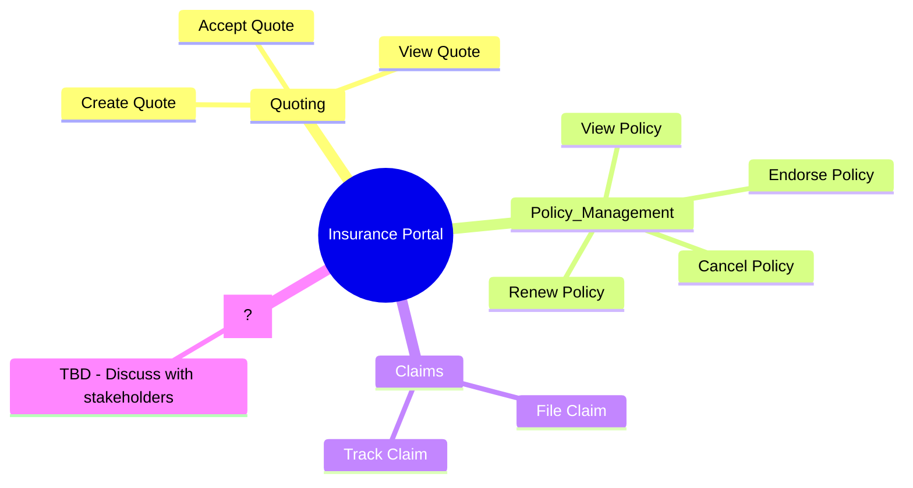

# PRD Writing Agent - User Guide

This guide explains how to use the **PRD Writing Agent** to transform raw project documents into a comprehensive Product Requirements Document (PRD) using an **interactive discovery process**.

---

## The Methodology: Interactive Discovery

This agent doesn't just "generate" a PRD—it **coaches you through professional BA techniques** to extract hidden requirements ("Gas") that you might not have articulated yet.

### The 5-Step Discovery Cycle

```
┌─────────────────────────────────────────────────────────────────┐
│ 1. DATA INGESTION                                               │
│    Upload all available documents (messy is OK).                │
└─────────────────────────────────────┬───────────────────────────┘
                                      ↓
┌─────────────────────────────────────────────────────────────────┐
│ 2. GAP ANALYSIS                                                 │
│    Agent identifies weak areas OR user suggests a focus.        │
└─────────────────────────────────────┬───────────────────────────┘
                                      ↓
┌─────────────────────────────────────────────────────────────────┐
│ 3. TOOL SELECTION                                               │
│    Agent recommends a Discovery Tool based on the gap.          │
└─────────────────────────────────────┬───────────────────────────┘
                                      ↓
┌─────────────────────────────────────────────────────────────────┐
│ 4. TOOL EXECUTION                                               │
│    Run the tool interactively until complete. Show output.      │
└─────────────────────────────────────┬───────────────────────────┘
                                      ↓
┌─────────────────────────────────────────────────────────────────┐
│ 5. INCORPORATE FINDINGS                                         │
│    Merge discoveries into the PRD. Repeat from Step 2.          │
└─────────────────────────────────────────────────────────────────┘
```

---

## The 9 Discovery Tools

The agent has access to these professional BA techniques. It will **recommend** a tool based on what it sees is missing from your input:

| # | Tool | When AI Suggests It | Output |
| :--- | :--- | :--- | :--- |
| 1 | **Mind Map** | Scope is unclear, need to visualize features | `mindmap.mmd` |
| 2 | **Brainstorming / What-If** | Feature mentioned without related considerations | `brainstorm.md` |
| 3 | **Roleplay / Persona Interview** | Multiple user types, vague user needs | `roleplay_transcript.md` |
| 4 | **CRUD Analysis** | Data entities mentioned (User, Order, Policy) | `crud_matrix.md` |
| 5 | **Premortem / Edge Cases** | Error handling not discussed | `risk_matrix.md` |
| 6 | **Traceability Matrix** | Need to link business goals to features | `rtm.md` |
| 7 | **State Transition Diagram** | Entity with lifecycle (e.g., Order Status) | `state_diagram.mmd` |
| 8 | **Decision Table** | Complex business rules (If X and Y, then Z) | `decision_table.md` |
| 9 | **BDD / Gherkin Scenarios** | Ready for acceptance criteria | `scenarios.feature` |

---

## Part 1: Data Ingestion

**Goal**: Feed the agent everything you have. Don't worry about structure—the agent will help you organize it.

### Option A: NotebookLM Pre-Processing (Recommended for 20+ Docs)
If you have many documents, use NotebookLM first:
1. Go to [NotebookLM](https://notebooklm.google.com/).
2. Upload PDFs, slides, notes, emails.
3. Export the **Summary** and **FAQ** to `inputs/notebooklm_summary.md`.

### Option B: Direct Upload (< 20 Docs)
Place your documents directly in the `inputs/` folder:
- Markdown files (`.md`)
- Text files (`.txt`)
- PDFs (will be parsed)

---

## Part 2: Running the Agent (Interactive Mode)

### Step 1: Start the Agent

You can start the agent in 3 ways:

**Option A: Terminal (Standard)**
```bash
cd 01_Requirements/prd_agent
python prd_agent.py --interactive
```

**Option B: Gemini Slash Command**
In Gemini Code Assist chat, type:
```
/prd-discover
```

**Option C: Natural Language (MCP)**
Just ask Gemini:
> "Help me discovery requirements for this project."
> "Start an interactive PRD session."

### Step 2: Agent Ingests Data
The agent reads all files in `inputs/` and provides an initial assessment:

```
Agent: I've ingested 5 documents.

Initial Assessment:
✓ Business objectives are clear.
✓ 3 user types identified: Admin, Agent, Customer.
⚠️ GAP: No success metrics defined.
⚠️ GAP: Data entities mentioned but not detailed.
⚠️ GAP: "Quote" entity has a lifecycle not fully described.

I recommend starting with:
1. [Mind Map] - To visualize the feature scope.
2. [State Diagram] - To map the Quote lifecycle.

Which would you like to start with? (or type your own focus)
```

### Step 3: Execute a Discovery Tool
```
User: Mind Map

Agent: To build the Mind Map, tell me:
- What are the MAIN features of this system?
- Are there any features you're unsure about?

User: The main features are Quoting, Policy Management, and Claims.
      I'm not sure if we need Reporting.

Agent: Got it. Here's the Mind Map:



I marked "Reporting" as uncertain. Does this look right?
```

### Step 4: Iterate Until Complete
After each tool, the agent will:
1. Show the output.
2. Ask follow-up questions.
3. Suggest the next tool.
4. Update the PRD draft.

```
Agent: Mind Map saved to outputs/mindmap.mmd.

I noticed you have 3 user types (Admin, Agent, Customer).
I recommend a [Roleplay] to walk through each user's experience.

Ready to start? (yes/no/skip)
```

---

## Part 3: Incorporating Findings

After running discovery tools, the agent generates:

1. **`outputs/PRD_Draft.md`** - The structured PRD with all findings.
2. **`outputs/gap_analysis.md`** - Remaining gaps to address.
3. **`outputs/artifacts/`** - All tool outputs (mind maps, matrices, etc.).

### The Iteration Cycle
1. Review `gap_analysis.md`.
2. If gaps remain, run the agent again with new inputs or focus on specific gaps.
3. When `gap_analysis.md` shows no critical issues, finalize the PRD.

---

## Part 4: Authentication

This agent uses the `google-genai` SDK with **Vertex AI** mode.

```bash
gcloud auth application-default login
```

Ensure your `.env` file contains:
```
GCP_PROJECT_ID=your-project-id
GCP_LOCATION=us-central1
```

---

## Troubleshooting

- **"No valid documents found"**: Ensure input files have `.md` or `.txt` extensions.
- **Agent stuck in a loop**: Type `skip` to move to the next step.
- **Want to re-run a tool**: Type the tool name (e.g., `Mind Map`).
