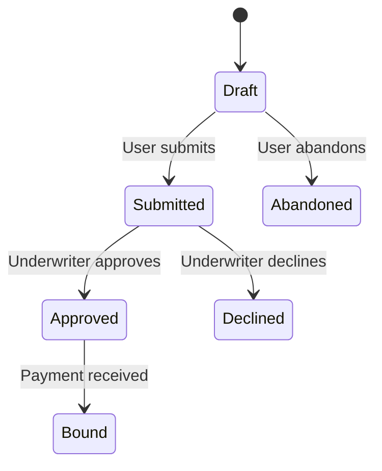

# Epic Elaboration Agent - User Guide

This guide describes how to use the **Epic Elaboration Agent** to flesh out Epic details using 9 professional discovery tools.

---

## Purpose

This agent takes an Epic shell (from the Decomposition Agent) and **elaborates it** with full details. It uses discovery tools to extract missing requirements ("Gas") that aren't yet documented.

**Input**: Epic shell (title, description, size estimate)
**Output**: Fully elaborated Epic with CRUD, states, edge cases, acceptance criteria

---

## The 9 Discovery Tools

The agent will recommend tools based on what it sees is missing:

| # | Tool | When AI Suggests It | Output |
| :--- | :--- | :--- | :--- |
| 1 | **Mind Map** | Epic scope unclear, need to visualize sub-features | `epic_mindmap.mmd` |
| 2 | **Brainstorming / What-If** | Feature needs related considerations explored | `epic_brainstorm.md` |
| 3 | **Roleplay / Persona Interview** | Need to validate user flow for this Epic | `epic_roleplay.md` |
| 4 | **CRUD Analysis** | Data entities in this Epic need operations defined | `epic_crud.md` |
| 5 | **Premortem / Edge Cases** | Error handling for this Epic not discussed | `epic_risks.md` |
| 6 | **Traceability Matrix** | Need to link Epic to PRD requirements | `epic_rtm.md` |
| 7 | **State Transition Diagram** | Epic involves entity lifecycle (e.g., Quote Status) | `epic_state.mmd` |
| 8 | **Decision Table** | Epic has complex business rules | `epic_decisions.md` |
| 9 | **BDD / Gherkin Scenarios** | Epic needs acceptance criteria | `epic_scenarios.feature` |

---

## How to Run

### Interactive Mode (Recommended)

### Interactive Mode (Recommended)

**Option A: Terminal (Standard)**
```bash
cd 02_Elaboration/epic_elaboration_agent
python epic_elaboration_agent.py --epic ../epic_decomposition_agent/outputs/EPIC-001.md --interactive
```

**Option B: Gemini Slash Command**
In Gemini Code Assist chat, type:
```
/epic-elaborate --epic outputs/EPIC-001.md
```

**Option C: Natural Language (MCP)**
Just ask Gemini:
> "Run elaboration on EPIC-001."
> "Discovery phase for the Quote features."

The agent will:
1. Analyze the Epic for gaps.
2. Recommend which tools to run.
3. Prompt you for each tool.
4. Show output and ask follow-up questions.
5. Save the fully elaborated Epic.

### Example Session

```
Agent: Analyzing Epic for gaps...

## Gap Analysis
1. Data operations not defined → Recommend: CRUD
2. Quote entity has lifecycle states → Recommend: State Diagram
3. No acceptance criteria → Recommend: BDD

## Suggested Starting Point
Start with CRUD to understand data operations.

============================================================
Which tool to run? [crud/state/bdd/done]: crud
Any specific focus or questions?: Focus on Quote and Driver entities

Running crud...

| Entity | Create | Read | Update | Delete |
|:---|:---|:---|:---|:---|
| Quote | ✓ | ✓ | ✓ | ✓ (Abandon) |
| Driver | ✓ | ✓ | ✓ | ✗ |

============================================================
Which tool to run? [crud/state/bdd/done]: state
Any specific focus or questions?: Quote lifecycle

Running state...



============================================================
Which tool to run? [crud/state/bdd/done]: done

Elaborated Epic saved to: outputs/EPIC-001_elaborated.md
```

---

## Non-Interactive Mode

For batch processing:
```bash
python epic_elaboration_agent.py --epic EPIC-001.md --output outputs
```

This runs gap analysis only. Review output and re-run with `--interactive` for specific tools.

---

## Workflow Integration

```
PRD.md
    ↓
Epic Decomposition Agent → EPIC-001.md (shell)
    ↓
Epic Elaboration Agent → EPIC-001_elaborated.md (full details)
    ↓
Story Agent → User Stories
```

---

## Next Step: Story Generation

Once an Epic is fully elaborated:
```bash
python ../story_agent/story_agent.py --epic outputs/EPIC-001_elaborated.md
```

---

## Authentication

```bash
gcloud auth application-default login
```

Ensure `.env` contains:
```
GCP_PROJECT_ID=your-project-id
GCP_LOCATION=us-central1
```
