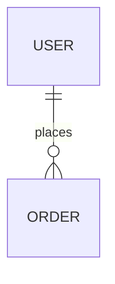

# System Design: {{ SYSTEM_NAME }}

## 1. Context (Level 1)
{{ CONTEXT_DESCRIPTION }}

## 2. Containers (Level 2)
*   [ ] **Web App:** ...
*   [ ] **API Service:** ...
*   [ ] **Database:** ...

## 3. Database Schema

## 4. API Contract
*   `GET /resource`: ...

## 5. Decision Records (ADRs)
*   **Decision:** ...
*   **Rationale:** ...
