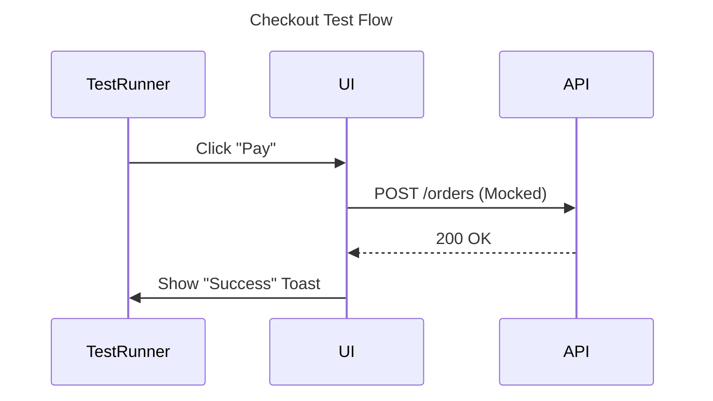
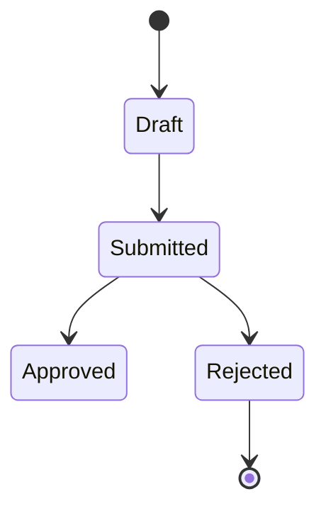

# 🧰 The Modern Testing Toolkit

## 1. Introduction

We have moved beyond the "Testing Pyramid" debate. In an AI-augmented world, quality is not valid *or* invalid; it is a multi-dimensional property of the software. This toolkit defines the **5 Dimensions of Quality** and how AI accelerates each.

---

## Dimension 1: Requirement Simulation (The "Pre-Code" Layer)
*Testing the idea before a single line of code is written.*

*   **The Concept:** Bugs found here cost $1. Bugs found in Prod cost $10,000.
*   **AI Accelerators:**
    *   **Persona Simulation:** "Act as a malicious user trying to double-spend."
    *   **Logic Stress-Testing:** "If I delete this user, what happens to their order history? Flag the orphaned state."
    *   **Result:** Verified Requirements (The "Solid" State).

---

## Dimension 2: Component Verification (The Pieces)
*Testing the implementation in isolation.*

*   **The Concept:** Before connecting the pipe, ensure the pipe doesn't leak.
*   **AI Accelerators:**
    *   **Parallel Unit Testing:** The AI Coding Agent writes `Vitest` cases *simultaneously* with the feature code.
    *   **Mutation Testing:** AI proactively changes arithmetic (`+` to `-`) to see if tests catch it, verifying test robustness.
    *   **Result:** 80%+ Unit Coverage with zero developer friction.

---

## Dimension 3: Contract Assurance (The Seams)
*Testing the connections between systems (API & Integration).*

*   **The Concept:** Services break at the edges. Contracts prevent this.
*   **AI Accelerators:**
    *   **Spec-Driven Generation:** AI reads the `OpenAPI` (Swagger) file and generates consumer-driven contract tests.
    *   **Mock Server Generation:** "Spin up a mock Payment Gateway that fails 5% of the time" to test resilience.
    *   **Result:** Mathematical certainty that Microservice A talks to Microservice B correctly.

---

## Dimension 4: Behavioral Validation (The Journey)
*Testing existing user value.*

### The "AC-to-Playwright" Process Flow
This is our flagship AI automation workflow:

1.  **Input 1 - The Truth:** The User Story containing **Gherkin ACs** ("Given/When/Then").
2.  **Input 2 - The Map:** The **Design Hub Wireframes** (Visual context for selectors).
3.  **The Agent:** `Agent: Generate-Tests` reads both.
4.  **The Output:** A fully executable **Playwright (.spec.ts)** script.

### The "Abstract-First" Strategy (Can we write tests before code?)
*   **The Problem:** We don't know the exact CSS IDs (`#submit-btn-v2`) before the developer builds the screen.
*   **The Solution:** We use **Semantic Locators**.
    *   The Wireframe shows a button labeled "Save".
    *   The AI writes: `await page.getByRole('button', { name: 'Save' }).click();`
    *   **Result:** This script works *regardless* of whether the underlying ID is `#save` or `#btn-primary`.
*   **Workflow:**
    1.  **Phase 1 (Skeleton):** AI generates the semantic test from the Wireframe/AC.
    2.  **Phase 2 (Implementation):** Developer builds the screen to match the Semantic Contract (must have a button named "Save").
    3.  **Phase 3 (Self-Healing):** If minor mismatches occur, the AI updates the test post-build.

*   **Why this works:** The Gherkin provides the *Logic*, the Wireframe provides the *Target*, and the Agent builds the *Bridge*.

---

## Dimension 5: Resilience & Safety (The Shield)
*Testing for the unknown.*

*   **The Concept:** Quality is also stability and security.
*   **AI Accelerators:**
    *   **Synthetic Data Factories:** AI generates 10,000 realistic user records for load testing.
    *   **Self-Healing Tests:** If a button ID changes from `#submit` to `#pay-now` but the text is the same, the AI "heals" the test selector automatically.
    *   **Chaos Agents:** AI proactively introduces latency in non-prod to verify failover logic.

---

## Summary: The AI-Native Quality Model

| Dimension | Focus | AI Role |
| :--- | :--- | :--- |
| **1. Simulation** | Requirements | The Simulator |
| **2. Components** | Functions/Classes | The Pair Programmer |
| **3. Contracts** | APIs/Integrations | The Diplomat |
| **4. Behavior** | User Flows | The User Proxy |
| **5. Resilience** | Security/Perf | The Sentry |

---

## 6. Visualizing Quality: Diagrams as Code for Tests

Just as we code our architecture diagrams, we define our **Test Logic** visually using Mermaid.

### A. Sequence Diagrams for E2E Flows
Instead of reading 100 lines of Playwright code, we generate a Sequence Diagram to validate the "Orchestration".

### B. State Diagrams for Model-Based Testing
We map the valid states of an entity to ensure we test all transitions.

*   **AI Prompt:** *"Generate a Playwright test that traverses every arrow in this state diagram."*

### C. Dependency Maps for Impact Analysis
We visualize which tests cover which components.
## 7. The Prerequisites Matrix

To activate these AI Testing Agents, specific artifacts must be present in the repository.

| Test Dimension | AI Agent / Type | **CRITICAL PREREQUISITE** (What must exist first) | Why? |
| :--- | :--- | :--- | :--- |
| **1. Simulation** | The Simulator | **User Personas** (in `docs/personas/`) | AI needs a character to "roleplay" to find edge cases. |
| **2. Components** | Unit Tests | **Function Signature** (Code) | AI needs at least the function skeleton (inputs/outputs) to write the test. |
| **3. Contracts** | Contract Tests | **OpenAPI Spec** (in Architecture Hub) | AI cannot verify a contract that hasn't been defined. |
| **4. Behavior** | E2E (Playwright) | **Gherkin ACs** + **Wireframes** (Design Hub) | Gherkin gives the *Logic*, Wireframes give the *Target Elements*. |
| **5. Resilience** | Load Tests | **Usage Profile** (e.g., "1k users/min") | AI needs a target load to generate the `k6` script. |

